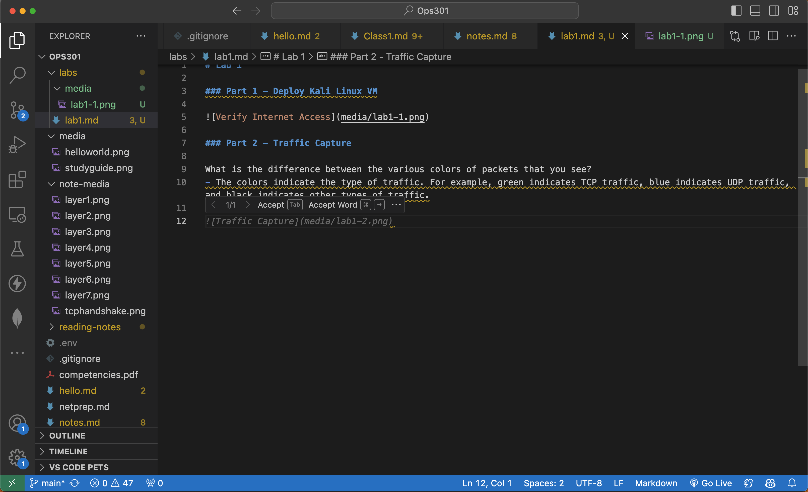
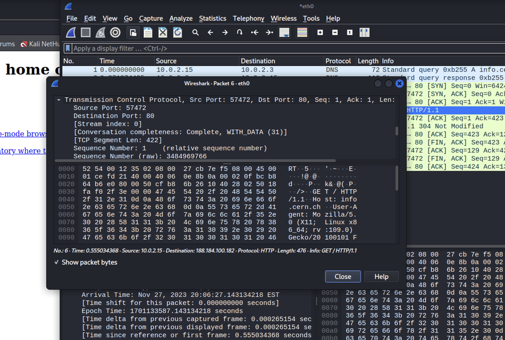
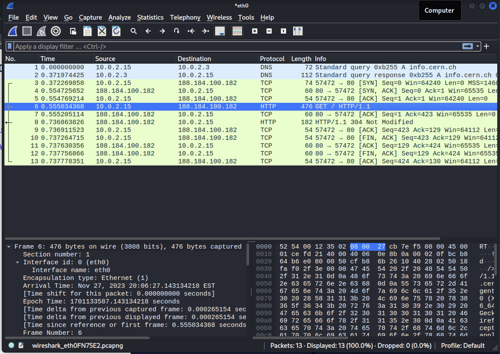
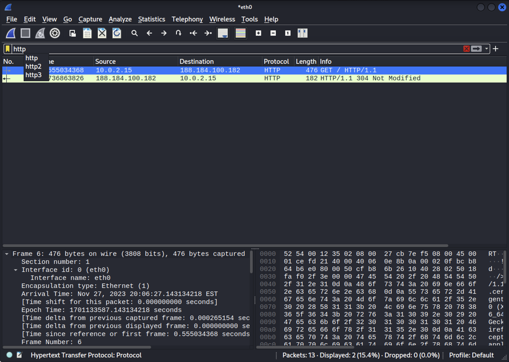
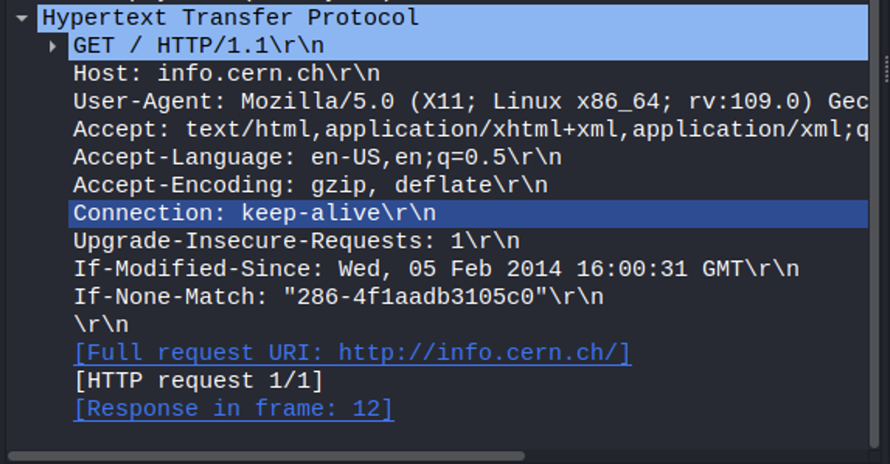

# Lab 1

### Part 1 - Deploy Kali Linux VM

### Part 2 - Traffic Capture

What is the difference between the various colors of packets that you see?
- The colors indicate the type of traffic. For example, green indicates TCP traffic, blue indicates UDP traffic, and black indicates other types of traffic.

### Part 3 - TCP Analysis

How many segments are used here?
- 422

 
What is the length in bytes of each segment?
- See above screenshot.
 
Can You identify all three packets involved in the TCP three-way handshake? Include a screenshot of them.

 
How much data is typically acknowledged per ACK?
- 54 or 60 bytes

### Part 4 - HTTP Analysis

 
Common HTTP headers:

### Part 5 - Wrapup
Search [Indeed](https://www.indeed.com/) for Wireshark
- 1,763 jobs, varying titles and duties, wide range of compensation

Why is network traffic analysis a relevant skill to have?
- Network traffic analysis is a relevant skill to have because it allows you to see what is happening on your network. It can help you identify malicious activity, such as a hacker trying to gain access to your network. It can also help you identify network issues, such as a misconfigured router or switch.

Do I see myself working in this type of job in the future?
- Yes.  I am going to do start a SoHo focused MSP that will harden and update networks for small businesses and large homes.

