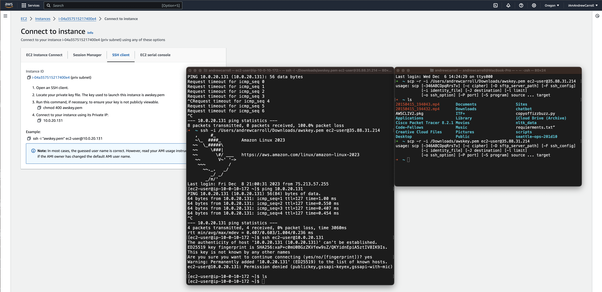

# Lab: AWS VPC

## Overview

Networking in the AWS cloud differs substantially from traditional on-prem LANs. Understanding how to build efficient and resilient network infrastructure on a cloud platform is an important skill. Today you will be creating a basic network environment that will consist of a VPC, two subnets, two EC2 instances and an Internet Gateway.

## Scenario

GlobeX is considering moving some of their infrastructure to the AWS cloud. You have been tasked with creating GlobeX's first VPC, two subnets, two EC2 instances and an Internet Gateway.

## Prerequisites

- An account with Amazon Web Services (AWS) and a valid form of payment (don't worry, you shouldn't generate more than a few dollars)

## Objectives

- Create a VPC
- Create both a public and a private subnet within your VPC
- Create two EC2 instances, one in each of your subnets
- Create an Internet Gateway
- Depict the topology in a diagram

## Resources

- [What is Amazon VPC?](https://docs.aws.amazon.com/vpc/latest/userguide/what-is-amazon-vpc.html){:target="_blank"}
- [Default VPC and default subnets](https://docs.aws.amazon.com/vpc/latest/userguide/default-vpc.html){:target="_blank"}
- [Draw.io AWS Icon Library](https://app.diagrams.net/?libs=aws2){:target="_blank"}
- [Example AWS topology](https://randops.org/2016/12/18/aws-diagrams-with-draw-io/){:target="_blank"}

## Tasks

### Part 1: Topology 1/2

Read through the entire lab and use Draw.io to create an appropriate topology of the network you expect to construct. Include as many details as you can such as computer names, OS types, IP addresses, etc. Include a screenshot of this initial topology.

  ### Part 2: Creating a VPC

For this lab, you'll be creating a VPC on AWS. A VPC is a virtual network within the AWS Cloud. A VPC allows you to provision your own isolated section of AWS, very similar to designing and implementing a separate independent network in an on-premises data center.

- Open the [Amazon VPC console](https://console.aws.amazon.com/vpc/)
- In the navigation pane, choose **Your VPCs** > **Create VPC**
- Under **VPC settings** select **VPC only**
- Specify the following VPC details and then choose **Create**
  - **Name tag**: `VPC-LAB10`
  - **IPv4 CIDR block**: Specifies an IPv4 CIDR block for the VPC. For example: `10.1.0.0/16`
    - Lab Actual IPv4 CIDR block: `10.0.0.0/16`

Include a screenshot of your VPC configuration screen in your submission.

### Part 3: Create VPC subnets

Next, create one public subnet and one private subnet.

**Create a private subnet**

A **private subnet** is one in which its resources cannot communicate directly with the Internet.

- In the left navigation pane, choose **Subnets**
- Choose **Create Subnet**
  - For **VPC**, choose the VPC that you created earlier
  - **Subnet Name**: `PRIV-SUBNET-LAB10`
  - **Availability Zone**: choose an Availability Zone for your subnet
    - US West (Oregon) / us-west-2a
  - **IPv4 CIDR Block**: enter a valid CIDR block. For example, `10.1.20.0/24`
    - Lab actual IPv4 CIDR block: `10.0.20.0/24`
- Click **Create Subnet**

Private Subnet Configuration

**Create a public subnet**

A **public subnet** is one in which its resources can communicate with the Internet.

- Choose **Create Subnet**
  - For **VPC**, choose the VPC that you created earlier
  - **Subnet Name**: `PUB-SUBNET-LAB10`
  - **Availability Zone**: choose an Availability Zone for your subnet
  - **IPv4 CIDR Block**: enter a valid CIDR block. For example, `10.1.10.0/24`
- Click **Create Subnet**

Public Subnet Configuration

On the subnet page in the VPC console select the Subnet you just created.

- Choose **Action** > **Edit subnet settings**
- Select **Enable auto-assign public IPv4 address** and choose **Save**

Include a screenshot of your subnet configuration screens in your submission.

Enable auto-assign public IPv4 address

### Part 4: Create an Internet gateway (IGW)

- In the left navigation pane, choose **Internet Gateways** > **Create internet gateway**
  - **Name tag**: `IGW-LAB10`
  - Choose **Create**
- Select the Internet Gateway that you just created
  - Choose **Action** > **Attach to VPC**

Create Internet Gateway

Attach Internet Gateway to VPC

**Create a Route Table**

- In the left navigation pane, choose **Route Tables** > **Create Route Table**
  - **Name**: `RT-LAB10`
  - Under **VPC** select the VPC you created on step 1
  - Choose **Create route table**

Create route table

- Select the route table you just created and choose **Action** > **Edit Routes**
  - Choose **Add route**
    - **Destination**: `0.0.0.0/0`
    - **Target**: `IGW-LAB10`
  - Choose **Save Route**

Add Destination and Target

- Continue to click on **Action** > **Edit Subnet Associations**
- Select the `PUB-SUBNET-LAB10`, then click **Save**

Edit Subnet Associations

Include a screenshot of your IGW and route table configuration screen in your submission.

Private Subnet Route Table

### Part 5: Create Security Groups for subnets

**Create Security Group for public subnet**

- In the left navigation pane, choose **Security Group** > **Create Security Group**
- Specify the following Security Group details:
  - **Security Group name**: `PUB-SG-LAB10`
    - Lab Actual Security Group name: `pug-sg-lab10`
  - **VPC**: `VPC-LAB10`
  - **Description**: A short description stating what the security group does
- In the **Inbound Rules** area, click **Add rules**
  - **Type**: SSH, **Source**: My IP
  - **Type**: All ICMP IPv4, **Source**: Anywhere
  - Then click **Create Security Group**

Public Security Group Configuration

**Create Security Group for private subnet**

- In the left navigation pane, choose **Security Group** > **Create Security Group**
- Specify the following Security Group details:
  - **Security Group name**: `PRIV-SG-LAB10`
    - Lab Actual Security Group name: `priv-sg-lab10`
  - **VPC**: `VPC-LAB10`
  - **Description**: A short description stating what the security group does
- In the **Inbound Rules** area, click **Add rules**
  - **Type**: SSH, **Source**: Anywhere
  - **Type**: All ICMP IPv4, **Source**: Anywhere
  - Then click **Create Security Group**

Private Security Group Configuration

### Part 6: Create EC2 Instances

**Create EC2 on public subnet**

- Open the [AWS EC2 console](https://console.aws.amazon.com/ec2/)
- In the left navigation pane, choose **Instances** > **Launch Instance**
  - Choose a default 'Free tier eligible" Linux Amazon Machine Image (AMI).
  - Choose an Instance Type: `General purpose t2.micro`

Instance Configuration

- Select **Create new key pair**
  - **Key pair name**: `awskey`

Key Pair Configuration

- Configure Instance Details
  - **Network**:  `VPC-LAB10`
  - **Subnet**: `PUB-SUBNET-LAB10`
  - **Auto-assign Public IP**: Enable
  - Configure Security Groups
    - **Assign a security group**: Select the security group named `PUB-SG-LAB10`

EC2 Instance Configuration

- Then click **Review and Launch** > **Launch**
- Choose **View Instance** and wait for the EC2 instance to initialize

**Create EC2 on private subnet**

- Open the [AWS EC2 console](https://console.aws.amazon.com/ec2/)
-In the left navigation pane, choose **Instances** > **Launch Instance**
  - Choose a default 'Free tier eligible" Linux Amazon Machine Image (AMI).
  - Choose an Instance Type: `General purpose t2.micro`

Priv Subnet EC2 Instance Configuration

- Configure Instance Details
  - Select the same key pair you created while creating the last instance (`awskey`)
  - **Network**:  `VPC-LAB10`
  - **Subnet**: `PRIV-SUBNET-LAB10`
  - **Auto-assign Public IP**: Disable
  - Configure Security Groups
    - **Assign a security group**: Select the security group named `PRIV-SG-LAB10`

Priv Subnet EC2 Instance Configuration

- Then click **Review and Launch** > **Launch**
- Choose **View Instance** and wait for the EC2 instance to initialize

Include a screenshot of your EC2 configuration screens in your submission.

### Part 7: Testing Connectivity

- Navigate to EC2 > Instances > 'specific instance' > Connect to instance > SSH Client tab
Instance ID: i-0ffb7bf31be58d029 (pub subnet)

1. Open an SSH client. (command line)
2. Locate your private key file. The key used to launch this instance is awskey.pem
   - This was automatically downloaded when you created the key pair.
3. Run this command, if necessary, to ensure your key is not publicly viewable: `chmod 400 awskey.pem`
4. Connect to your instance using its Public IP: `35.88.31.214`
Example: `ssh -i "file path to awskey.pem" ec2-user@35.88.31.214`

- Try to ping and SSH to the instance in the public subnet `PUB-SUBNET-LAB10`
  - Were these tests successful and if so, why or why not?
    - Yes.  These were successful because the rules are set properly and they are open to the public, per se.

Ping 35.88.31.214

SSH to 35.88.31.214

- Try to ping and SSH to the instance in the private subnet `PRIV-SUBNET-LAB10`
  - Were these tests successful and if so why or why not?
    - Initially I was unable to ping or SSH into the private because I was not connected to the public subnet.  Once I connected to the public subnet I was able to ping the private subnet.

Ping Priv Subnet: Failure

Ping Priv Subnet: Success

SSH command to copy awskey from my laptop to the public subnet
- `scp -i /Users/andrew/downloads/awskey.pem /Users/andrew/downloads/awskey.pem ec2-user@35.88.31.214:/home/ec2-user`
  - `scp -i "file pathe to awskey.pem" "file to be copied" ec2-user@<domain ip address>:"file path to copy to"`

SSH command to connect to the private subnet
- `ssh -i /home/ec2-user/awskey.pem ec2-user@10.0.20.131`

SSH to Priv Subnet: Success after copying the awskey from my laptop to the public subnet

Include a screenshot of your ping and SSH results in your submission.

### Part 8: Topology 2/2

When the other tasks are complete, review the topology and update, revise, extend, or add details as necessary.

Was your initial topology accurate to the finished product? Why or why not?

## Stretch goals (Optional Objectives)

- Create an Elastic IP address and a NAT Gateway to provide the instance in the private subnet access to the Internet.

## Submission Instructions

1. Create a new blank Google Doc. Include above assignment submission text and images within this Google Doc.
1. Name the document according to your course code and assignment.
   - i.e. `seattle-ops-201d1: Lab 04`.
1. Add your name & date at the top of the Google Doc.
1. Share your Google Doc so that "Anyone with the link can comment".
1. Paste the link to your Google Doc in the discussion field below and share an observation from your experience in this lab.
