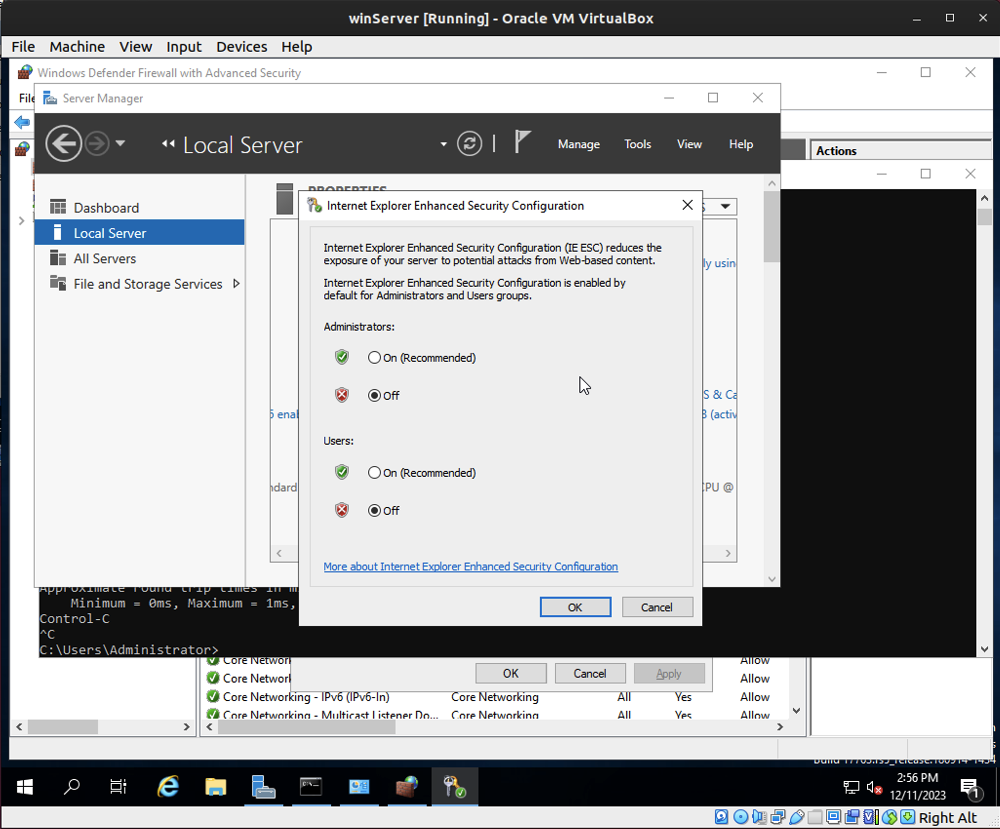
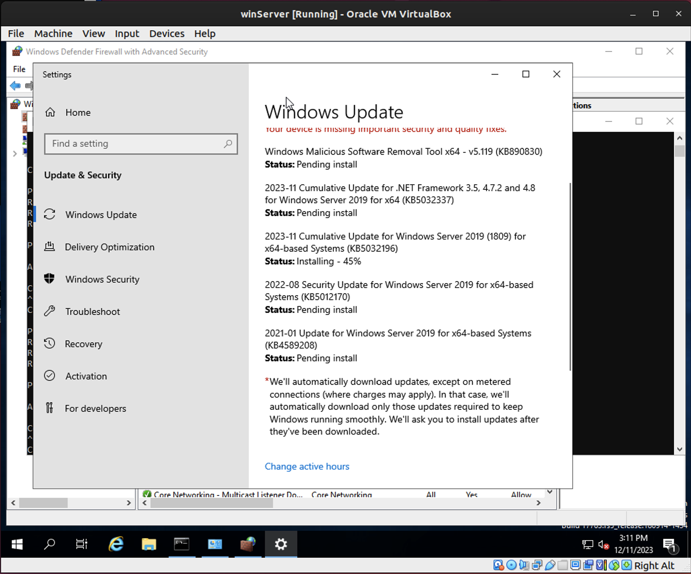
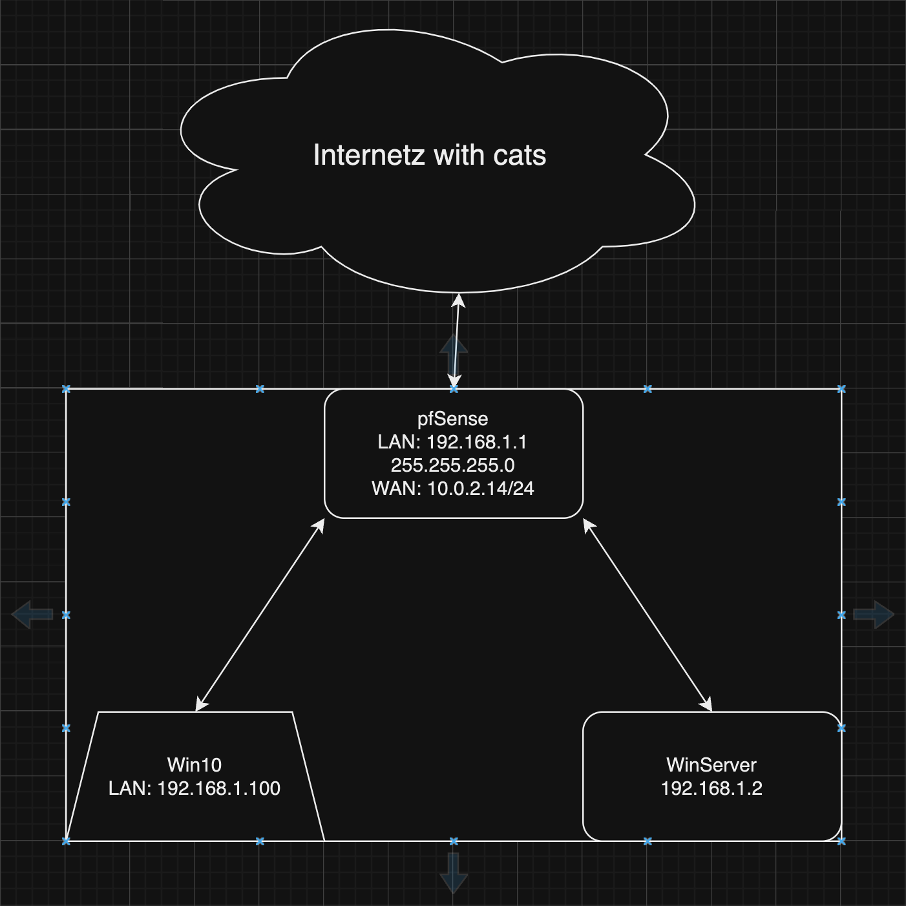

# Lab: Windows Server

## Overview

Microsoft Windows Server is an OS that facilitates the hosting of critical authoritative Windows services on the network, including Active Directory, DNS, DHCP, and Domain Controller roles. Microsoft's Evaluation Center allows for the use of Windows Server for 180 days free with full functionality. When deployed in tandem with Windows 10 Pro endpoints, once can establish a domained LAN with little more than VirtualBox and some relevant Microsoft documentation.

## Scenario

GlobeX LLC is a small startup in Springfield, OR with big dreams. According to its founder and CEO, Keytron Rusk, its mission is "to manufacture and deliver cutting edge products that contribute to sustainable, renewable energy." By harnessing scientific breakthroughs made by [Belgian scientists in 2017](https://www.mic.com/articles/176543/scientists-figured-out-how-to-convert-polluted-air-into-clean-energy){:target="_blank"}, GlobeX steadily developed international clientele with its groundbreaking AirPower machines that converted CO2 emissions and other toxins in the air to a source of electrical energy. The company is now making aggressive acquisitions and expansions in strategic areas of the world.

GlobeX is now at a technological crossroads with its IT infrastructure; it must either adapt its systems to modern standards, or be held back by its antiquated internal practices and expose itself to higher levels of risk. You have been hired at GlobeX as the new Systems Administrator reporting directly to Mr. Rusk. You will be responsible for both critical IT systems administration and network operations in this exciting new role.

After performing your initial survey of GlobeX systems, you gather that the company mostly runs virtual Windows 10 Professional 64-bit endpoints. However, GlobeX computer systems are inconsistently configured, resulting in a high rate of data loss, regulatory compliance violations and operational dissatisfaction. Your first task is to deploy Windows Server to the LAN so that the process of migrating from Workgroup to Domain can begin. You'll need to shop for one within the company's budgetary constraints, then deploy it.

## Resources

- [Windows Server 2019 ISO Download](https://www.microsoft.com/en-US/evalcenter/evaluate-windows-server-2019?filetype=ISO){:target="_blank"}
- [Windows 10 ISO Download](https://www.icloud.com/iclouddrive/01azgWsJOfzZaBbAj-G3sLWTg#Windows10){:target="_blank"}
- [AD DS Installation and Removal Wizard Page Descriptions](https://docs.microsoft.com/en-us/windows-server/identity/ad-ds/deploy/ad-ds-installation-and-removal-wizard-page-descriptions){:target="_blank"}

## Prerequisites

- Deploy pfSense router/firewall as a FreeBSD VM to your local VirtualBox Manager. This is performed in previous courses.
- Deploy a Windows 10 VM to your local VirtualBox Manager. This is performed in previous courses.

## Objectives

- Shop online for a server priced below $5,000 and discuss why you chose it. (Purchase not required!)
- Deploy Windows Server 2019 as a VM to your local VirtualBox Manager.
- Virtually plug the Windows Server VM into the pfSense VM. This should be the same LAN subnet as your Windows 10 PC.
- Assign the VM a static IP using DHCP reservation on your pfSense VM.
- Verify connectivity from Windows Server to Windows 10.
- Disable enhanced security feature on Internet Explorer in Windows Server.
- Verify internet connectivity on Windows Server.
- Perform Windows Update on the server until it is fully patched to latest possible version.
- Create a professional network topology diagram that reflects your current deployments.

## Tasks

Today you'll be deploying Windows Server 2019 as part of the project to transition GlobeX from Workgroup to Domain on its network.

### Part 1: Server Shopping

- Choose a rack mount server for sale on the internet that costs less than $5,000. What's the best deal out there for GlobeX and why did you choose the one you did?
  - List out the specs of the server you found (RAM, CPU, Storage, etc.)
  - Given the budget, what would be the pros and cons for Globex to purchase the server hardware instead of using a cloud provider.

> No need to actually purchase a rack mount server for yourself, but you can if you want to!

**The real answer here is to put them on a cloud provider like AWS or Azure.**
- If they insist on a server I would recommend a Dell PowerEdge R730xd. It has 2 Intel Xeon E5-2620 v4 2.1GHz 8 Core Processors, 64GB DDR4 Memory, 12TB (6 x 2TB) 7.2K SATA 2.5" 6Gb/s Hard Drives, PERC H730 RAID Controller, Redundant Power Supplies, and Windows Server 2019 Standard. It is $4,999.99 on [Amazon](https://www.amazon.com/Dell-PowerEdge-R730xd-Server-2-1GHz/dp/B07Q3GQZ7X/ref=sr_1_1?dchild=1&keywords=server&qid=1619103283&sr=8-1){:target="_blank"}.

### Part 2: Server Deployment

- Deploy Windows Server 2019 as a VM to your local VirtualBox Manager.
  - Create a new VM. Document the CPU, RAM, and storage allocations you've made to this VM.
  - Start by downloading the installer ISO and booting into it.
  - During installation, select "Windows Server 2019 Standard Evaluation (Desktop Experience)"
  - You'll need to select partitioning just like a Win 10 installation.
- When the OS is installed, export it to an OVA in case you need to start fresh on this OS again.
- Install VirtualBox Guest Additions for this VM for optimal interactivity

**WinServer Knowledge Base**
- User: Administrator
- Password: P@ssword
- CPU: 2
- RAM: 8GB
- Storage: 16GB
- IP: 192.168.1.101 (This is not the static IP.  This is the initial IP set via pfSense initial config.)
  - After setting up static IP via pfSense GUI (Status > DHCP Leases > + Add Static Mapping)
    **- New IP Address is 192.168.1.2**
- Subnet: 255.255.255.0
- Gateway: 192.168.1.1

**Win10 Knowledge Base**
- User: admin
- Password: admin
- IP: 192.168.1.100
- Subnet: 255.255.255.0
- Gateway: 192.168.1.1

**Setting Up a New pfSense**
- Option 2 sets up the LAN/WAN interface
- 2 for LAN
  - Config IPv4 address LAN interface via DHCP? N
  - Enter the new LAN IPv4 address (this is a gateway address): 192.168.1.1
  - Enter the new LAN IPv4 subnet bit count (1 to 30): 24
  - For a LAN, press <ENTER> for none: <ENTER>
- Config IPv6 address for LAN interface via DHCP6? N
  - <ENTER> for none
- Do you want to enable the DHCP server on LAN? (y/n) `this sets the ip address range for the LAN`: Y
  - Enter the start address of the IPv4 client address range: 192.168.1.100
  - Enter the end address of the IPv4 client address range: 192.168.1.200
- Option 7 to ping google to verify internet connection: 8.8.8.8
**never be afraid to use option 4 to reset to factory defaults**

### Part 3: Network Connectivity

- Virtually plug the Windows Server VM into the pfSense VM. This should be the same LAN subnet as your Windows 10 PC.
- Assign the VM a static IP using DHCP reservation on your pfSense VM.
  - Document the DHCP range.
    - DHCP range: 192.168.1.100 to 192.168.1.200
  - Document the reserved IP you've allocated for the Windows Server. Why did you choose this IP, and what are your plans for future reserved IPs on this subnet? Explain how you'll reserve them.
    - Reserved IP: 192.168.1.2
    - This was reserved because it is outside of the DHCP range and is similar to the pfSense server IP
  - Document the IP of Windows 10 VM. Did you also reserve it an IP (optional)? Explain your reasoning as if this were a production (real) network environment.
    - Win10 IP: 192.168.1.100
    - I did not make this a static IP.  It was assigned within the DHCP range set in pfSense.  I would not make this a static IP in a production environment because it is a workstation and not a server.
- Verify connectivity from Windows Server to Windows 10.
  - Setup new inbound / outbound rules on Windows Server firewall to allow ICMPv4 traffic.
- Disable enhanced security feature on Internet Explorer in Windows Server.
- Verify internet connectivity on Windows Server using its Internet Explorer/Edge browser.

pfSense and WinServer IP Configs

Pinging WinServer, Win10, and pfSense

Disable IE Enhanced Security

### Part 4: Updates

- Perform Windows Update on the server until it is fully patched to latest possible version.

Windows Update

### Part 5: Topology

- Create a professional network topology diagram that reflects your current deployments of the following assets:
  - PfSense router/firewall
  - Windows Server 2019
  - Windows 10
- Include IP address, OS, and computer name of each host near its icon.

Topology
