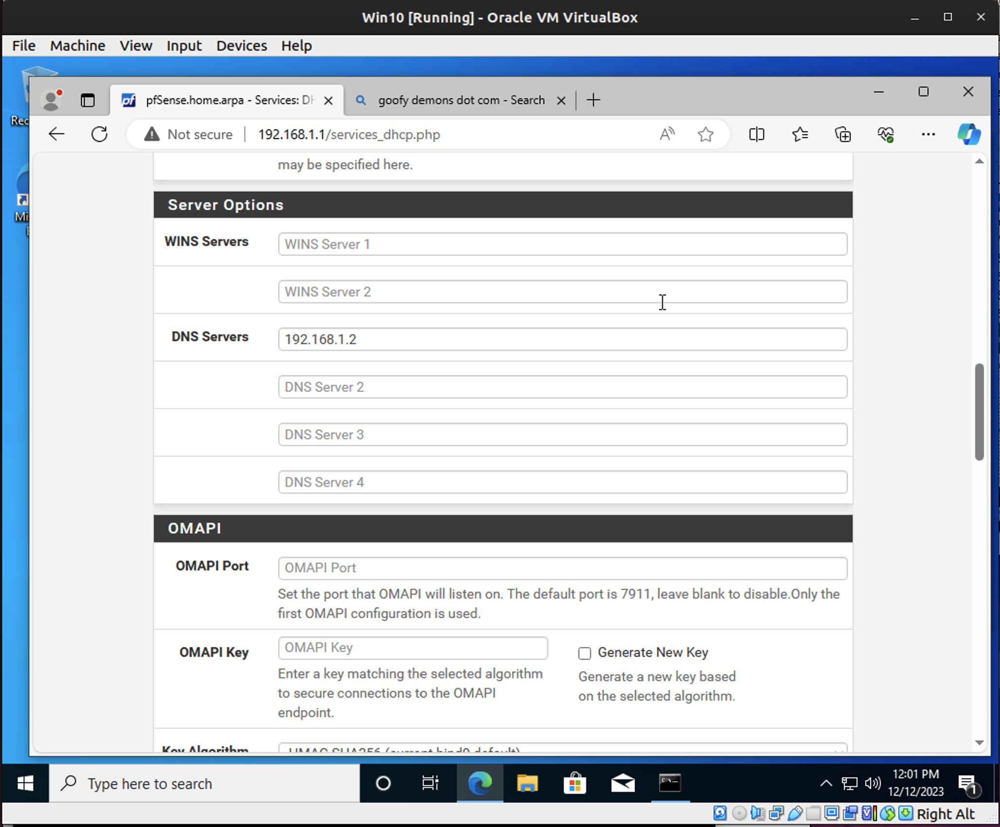
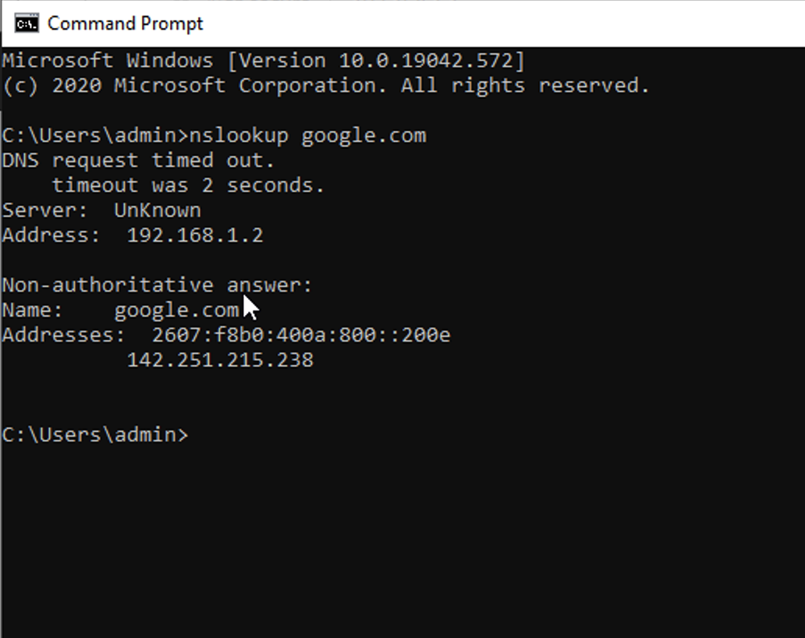
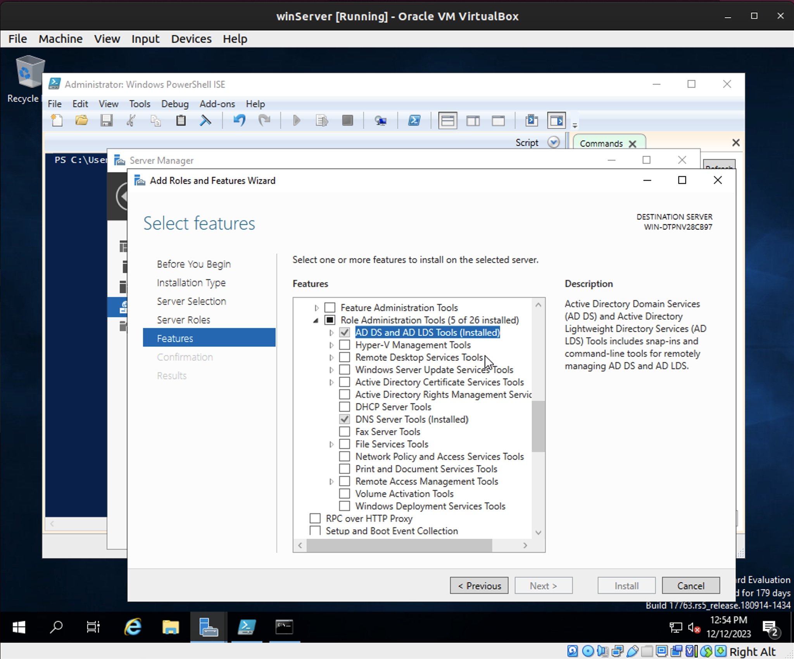
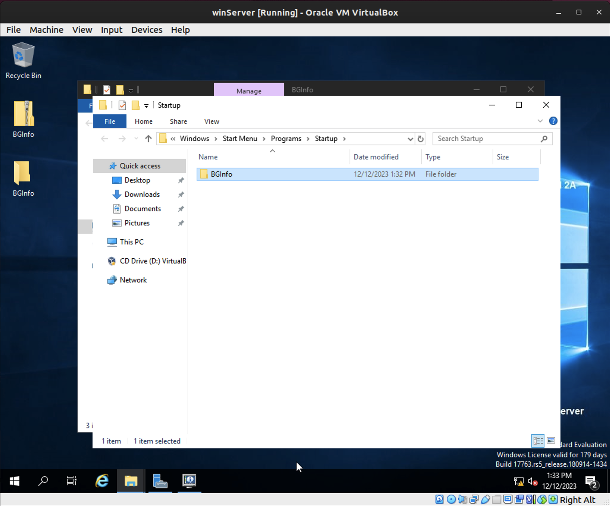
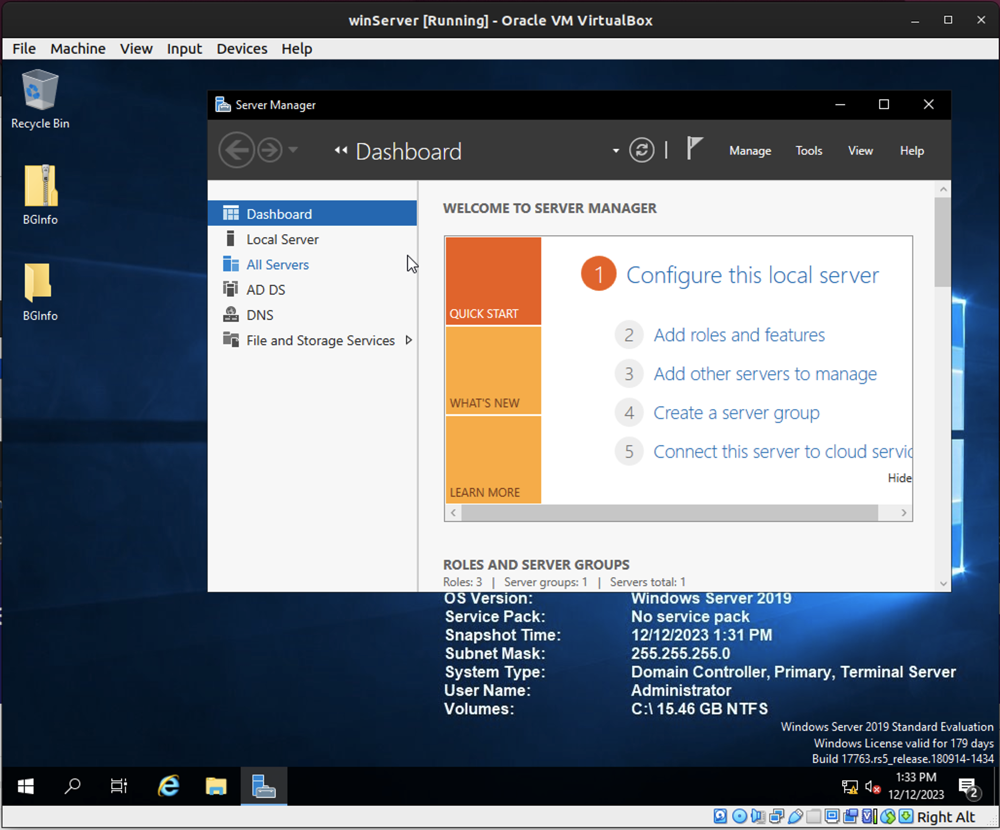
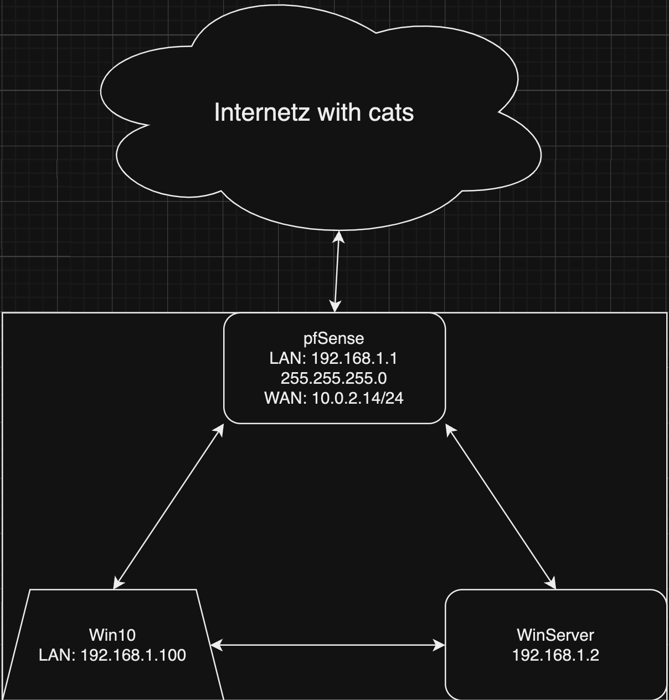

# Lab: Domain Controller

## Overview

During deployment of Windows Server one of the first steps is to assign it the correct roles and be promote it to DC (Domain Controller). Once promoted, the DC can not only facilitate centralized identity management with AD (Active Directory), but can also allow the systems administrator to "push" standardized configurations to Windows endpoints using GPOs (Group Policy Objects). Growing companies and enterprises alike will utilize these Windows Server features in order to more effectively administer endpoints at scale.

## Scenario

The GlobeX CEO has requested that endpoint configuration be centrally administered along with other critical services. "I've got sales reps losing customer data to random Windows updates!" he fumes. "This is unacceptable; how does anyone get any work done with these kinds of interruptions? I'm really hoping you can get our computers configured to some kind of standard."

As part of your project to transition GlobeX from Workgroup to Domain, the next step is to configure the new Windows Server so that it can perform these critical roles on the GlobeX network.

## Objectives

- Add the following roles to your Windows Server:
  - DC
  - AD
  - DNS
- Create a DNS entry in the forward lookup zone that changes how a domain name resolves.
- Promote this server to a Domain Controller (DC).
- Add a new forest and create a local domain, `corp.globexpower.com`, with a NetBIOS of `CORP`.
- Install BgInfo on the Windows Server.
- Update your network topology diagram with any changes made to your network.

## Resources

- [Microsoft Documentation - Install or Uninstall Roles, Role Services, or Features](https://docs.microsoft.com/en-us/windows-server/administration/server-manager/install-or-uninstall-roles-role-services-or-features){:target="_blank"}
- [How to create a Windows Domain and AD](https://www.informaticar.net/server-basics-06-how-to-create-windows-domain-active-directory/){:target="_blank"}

## Tasks

### Part 1: DNS

In order for AD and DC to function properly, we'll need to configure Windows Server to act as the DNS server for this LAN instead of pfSense. Ideally, pfSense should be configured to be aware that Windows Server's IP address is the DNS of this network.

- First, activate the DNS role on Windows Server using Server Manager.
  - Add Roles & Features > Role-Based or Feature-Based Installation > Select Server > Roles - DNS Server > Next > Next > Install

- Next, you'll need to point your network hosts to it as their DNS server. Configure pfSense to assign the DNS server for LAN hosts to use this Windows Server's IP address if possible; otherwise, you can manually assign DNS server IP via the Windows Server/Windows 10 network adapter settings.
  - Services > DHCP Server > LAN > Server Options > DNS Servers > 192.168.1.2 (WinServer IP) > Save > Apply Changes

- Verify that all devices have working DNS through Windows Server and can browse the internet.

`nslookup google.com` from Win10 Client

`nslookup google.com` Win10 Client, Server Firewall Rules, and pfSense ping 192.168.1.2

Win10 showing internet connection

- Test your DNS is working by applying a forward lookup zone. Create a new forward lookup that causes http://admin.globexpower.com to resolve as the IP address of pfSense.
  - DNS > Tools > DNS > Server WIN-DTPNV28CB97 > Forward Lookup Zones > New Zone > Primary Zone > Name: globexpower.com > Allow only secure dynamic updates > Finish
  - After the above, right click on the new zone and select New Host (A or AAAA) > Name: blank > IP Address: 192.168.1.1
  - Then run `ipconfig /flushdns` WinServer and Win10 Client

Testing proof of the DNS working to forward globexpower.com to pfsense panel

### Part 2: Active Directory

Activate AD DS role on Windows Server.

- Install server roles:
  - Active Directory Domain Services.

- Promote this server to a Domain Controller.
  - Server Manager > Ad DS > A Warning Bar MAY be displayed, click it > Then you look for "Add New Forest"
- Add a new forest. It's OK if your forest only has one tree.
  - Create a local domain using `corp.globexpower.com` as the root domain name.
- Set a DSRM password.
  - P@ssword
- Set the NetBIOS name to `CORP`.

### Part 3: BgInfo

Next, let's set up a software tool that reveals useful information about the computer.

- On Windows Server VM, download and install [BgInfo](https://docs.microsoft.com/en-us/sysinternals/downloads/bginfo){:target="_blank"} from Microsoft Sysinternals.
- Run BgInfo and configure it to your liking.
- Set BgInfo to automatically run on login.
  - start > run > shell:startup > copy BgInfo.exe shortcut to this folder
- Include a screenshot of your desktop in today's submission and mention how you got it to auto-run.

BG Info

Desktop for WinServer

> Consider deploying BgInfo to all your Windows VMs; it can save you time by posting all that valuable system information up front instead of hiding it behind menus or terminal commands.

### Part 4: Topology

Update your network topology diagram with any changes made to your network.

## Stretch Goals (Optional Objectives)

## Submission Instructions

1. Create a new blank Google Doc. Include above assignment submission text and images within this Google Doc.
1. Name the document according to your course code and assignment.
   - i.e. `seattle-ops-201d1: Reading 01` or `seattle-ops-201d1: Lab 04`.
1. Add your name & date at the top of the Google Doc.
1. Share your Google Doc so that "Anyone with the link can view".
1. Paste the link to your Google Doc in the discussion field below and share an observation from your experience in this lab.
