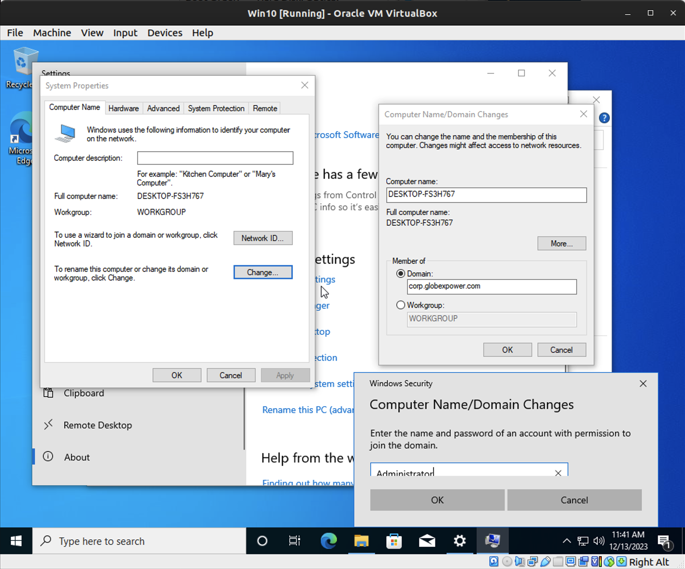
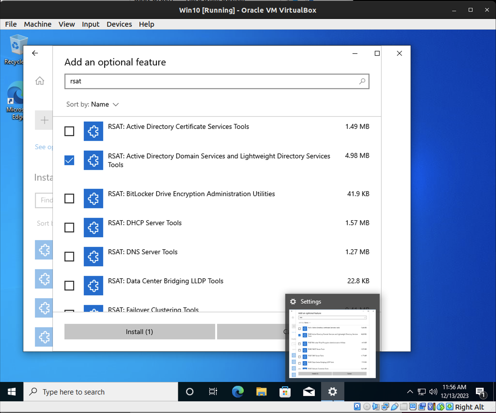
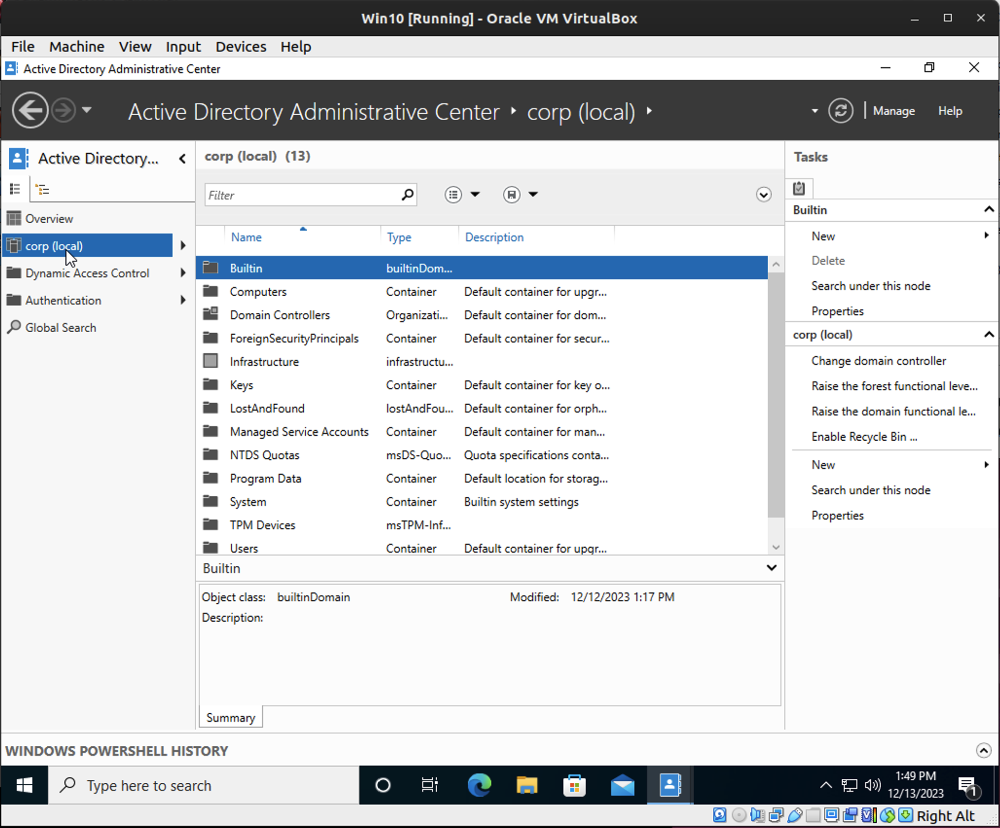
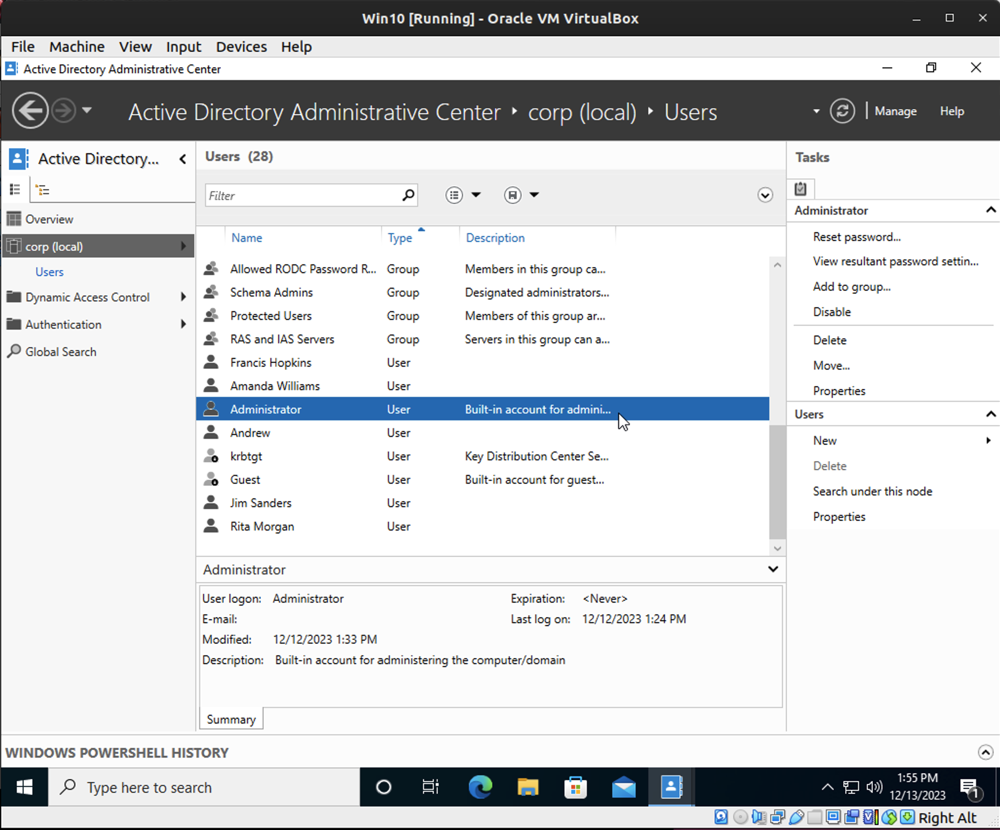
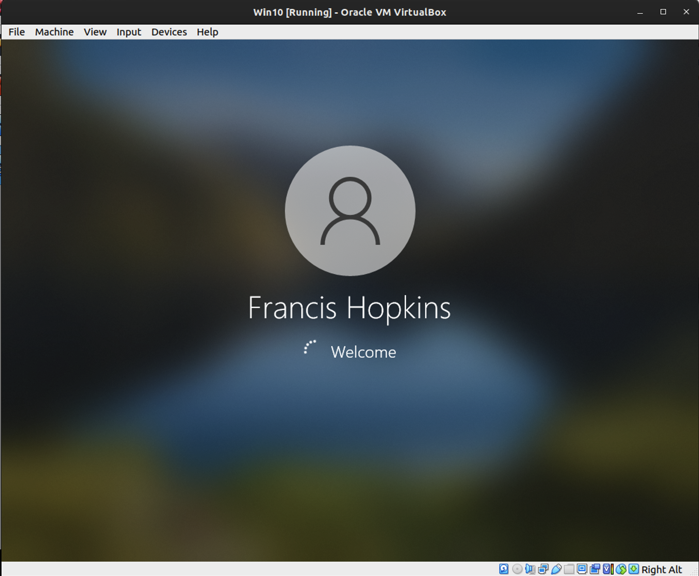

# Lab: Active Directory 

## Overview

ADAC (Active Directory Administrative Center) facilitates the convenient administration of user profiles from any Windows endpoint that can achieve connectivity with the DC. This application acts as a user identity control panel capable of many tasks ranging from user creation to simple password changes.

In order to issue group policy and allow users of Windows endpoints to access their AD profile, you'll need to join those endpoints to the domain.

## Scenario

The project to transition GlobeX to a domained system was originally motivated by a need to standardize computer configurations across the organization. The next task is to join GlobeX endpoints to the new DC.

## Objectives

- Join the Windows 10 endpoint to the newly-created domain
- Configure ADAC on the Windows 10 endpoint for use by the systems administrator
- Create the following user accounts on ADAC
  - Francis Hopkins, Sr. Account Executive, Sales Department, GlobeX USA
  - Amanda Williams, HR Specialist, HR, GlobeX USA
  - Jim Sanders, HR Manager, HR, GlobeX USA
  - Rita Morgan, CFO, Finance, GlobeX USA
  - Yourself, Systems Administrator, GlobeX USA
- Create OUs by department.
- Sign into the Windows 10 endpoint using each AD profile

## Resources

- [Microsoft Documentation - Active Directory Administrative Center](https://docs.microsoft.com/en-us/windows-server/identity/ad-ds/get-started/adac/active-directory-administrative-center){:target="_blank"}
- [Join Windows 10 to a Domain](https://www.itechguides.com/join-windows-10-to-domain/){:target="_blank"}

## Tasks

### Part 1: Join Endpoint to Domain

Join your Windows 10 endpoint to the domain. This can be done a number of ways. Here is one method:
- This can be done from the This PC > Properties menu. Right click "This PC" in Windows Explorer and select Properties to access this menu.
  - To find this you need to go to This PC > Properties > Rename this PC (advanced) > Change... > Select Domain and type in the domain name.
    - Find the domain name within the WinServer Manager panel for Local Server > Properties > Domain

- Locate the button "Change..." under Computer Name tab.
- Here under "Member of" section you can toggle into the Domain option and type the name of your domain. If you encounter errors, try entering the FQDN of your domain.
- Windows will then prompt you to authenticate as CORP\Administrator (or whoever you've set as the domain administrator).
- Windows will then prompt you to reboot to finalize the domain join procedure.

Entering the password to join the domain corp.globexpower.com

Success message after joining the domain corp.globexpower.com

### Part 2: AD Profile Creation & Login

- Install RSAT on the Windows 10 endpoint.
  - Settings > Apps > Optional features > Add a feature > Type RSAT in the search bar > Select RSAT: Active Directory Domain Services and Lightweight Directory Services Tools > Click Install

Installing RSAT pack

**After the computer restarts you will need to login with a Domain account.  I needed to create an admin user on the domain controller to login to the computer.  I used the following command to create the user:**
- WinServer > Tools > Active Directory Administrative Center > Users > New > User > First Name: > User UPN logon: username@corp.globexpower.com > UserSamAccountName: corp\username > Member Of: Adminstrators > save

- Configure ADAC to authenticate into the Windows Server.
  - By logging into the Win10 via the domain account, you should now be able to access ADAC.  This is authenticating into the WinServer.

ADAC on Win10

- In ADAC create the below users with the provided profile information.
  - Francis Hopkins, Sr. Account Executive, Sales Department, GlobeX USA
  - Amanda Williams, HR Specialist, HR, GlobeX USA
  - Jim Sanders, HR Manager, HR, GlobeX USA
  - Rita Morgan, CFO, Finance, GlobeX USA
  - Yourself, Systems Administrator, GlobeX USA

Users in ADAC

- Create OUs by department.
- Test that all profiles may login to the Windows 10 endpoint.

Users can login to the Win10 endpoint

### Part 3: Topology

Update your network topology diagram with any changes made to your network.

Topology

## Submission Instructions

1. Create a new blank Google Doc. Include above assignment submission text and images within this Google Doc.
1. Name the document according to your course code and assignment.
   - i.e. `seattle-ops-201d1: Reading 01` or `seattle-ops-201d1: Lab 04`.
1. Add your name & date at the top of the Google Doc.
1. Share your Google Doc so that "Anyone with the link can view".
1. Paste the link to your Google Doc in the discussion field below and share an observation from your experience in this lab.
