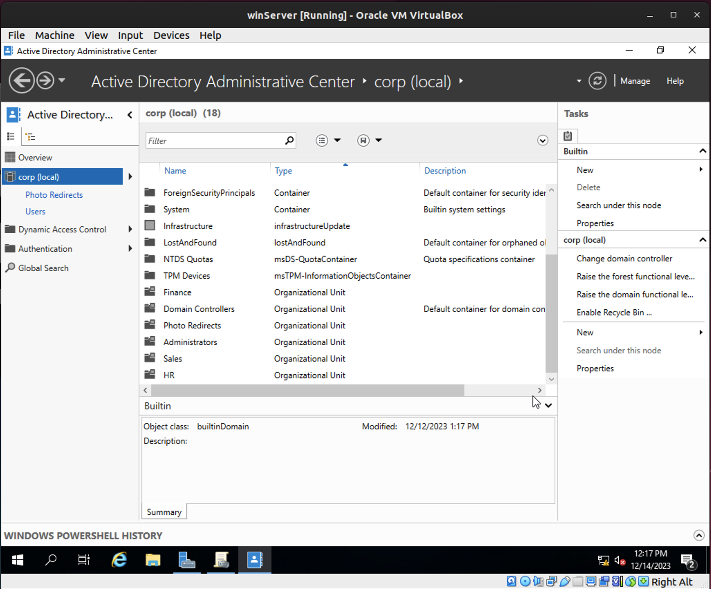

# Lab: Group Policy

## Overview

Systems administrations can use OUs (Organizational Units) and GPOs (Group Policy Objects) to apply computer configurations to specific departments or teams in the organization. Group policy can be used to protect user data by applying folder redirection to the Windows user files.

## Scenario

After a junior IT support technician accidentally deleted user data yesterday afternoon on a marketing executive's computer, management at GlobeX wishes to know how you intend to backup user profile data on Windows 10 endpoints to prevent such incidents in the future. 

## Resources

- [Group Policy Planning and Deployment Guide](https://docs.microsoft.com/en-us/previous-versions/windows/it-pro/windows-server-2008-R2-and-2008/cc754948(v=ws.10)){:target="_blank"}
- [Back to Basics: Groups vs Organizational Units in Active Directory](http://techgenix.com/back-basics-groups-vs-organizational-units-active-directory/){:target="_blank"}

## Objectives

- Create a user
- Create an OU
- Create a GPO that redirects user's Pictures folder to a shared folder on the Windows Server
- Validate the GPO works as expected to replicate a picture file to your Windows Server file share

## Tasks

### Part 1: GPO Creation

This part uses ADAC and GPMC.

- First you'll need to create a file share on Windows Server that is accessible by the domain user on your Windows 10 endpoint.
  - Don't worry about security settings for now, but as a stretch goal you should lock this folder down to the user who needs it
  - Turn on network discovery on the Windows Server > Make a new folder > right click > properties > sharing > advanced sharing > check share this folder > permissions > add > type in the user name > check names > ok > give the user proper permissions > apply > ok

Shared Folder

- Create a domain user.
  - Ran the powershell script from previous lab to create a user.

New User lab14 longtime

- Next create an OU that your domain user is affiliated with. This OU should be associated with the GPO you're making next.
  - Done in ADAC > right click on corp.globexpower.com > new > organizational unit > name: lab14 > ok

OU called Photo Redirect

- Create a GPO that redirects user's Pictures folder to a shared folder on the Windows Server.
  - Search Group Policy Management > expand Domains > corp.globexpower.com > Group Policy Objects > Right click in empty space > New > create new GPO

New GPO lab14 Photo Redirect

- Group Policy Management Editor
  - Group Policy Management > Domains > corp.globexpower.com > Group Policy Objects > lab14 Photo Redirect > Settings > Right Click User Configuration (Enabled) > Edit > User configuration > Windows Settings > Folder Redirection > Right click Pictures > Properties > Create the new redirect info

Pictures Properties
  

- Associate the policy with the domain user account you want to apply it to.

### Part 2: Policy Push & Testing

- Verify the folder redirection policy is effective by saving a picture to your Pictures folder and verifying it appears on the share in Windows Server. 
  - Remember how group policy is applied, and how you can force it to apply.
    - `gpupdate /force`
  - Some group policies only apply when the user logs in.
    - System restart and logged back in.

Showing the successful connection for the completion of the lab.

## Submission Instructions

1. Create a new blank Google Doc. Include above assignment submission text and images within this Google Doc.
1. Name the document according to your course code and assignment.
   - i.e. `seattle-ops-201d1: Reading 01` or `seattle-ops-201d1: Lab 04`.
1. Add your name & date at the top of the Google Doc.
1. Share your Google Doc so that "Anyone with the link can view".
1. Paste the link to your Google Doc in the discussion field below and share an observation from your experience in this lab.

# New Steps
File and Share > Shares > Tasks > New Share > SMB Share - Quick > Custom File Path > Share Name > Allow Caching > In Permissions Ensure the proper users are selected >  