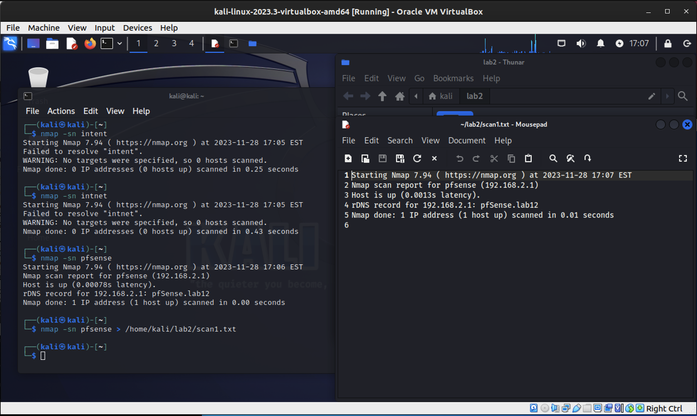
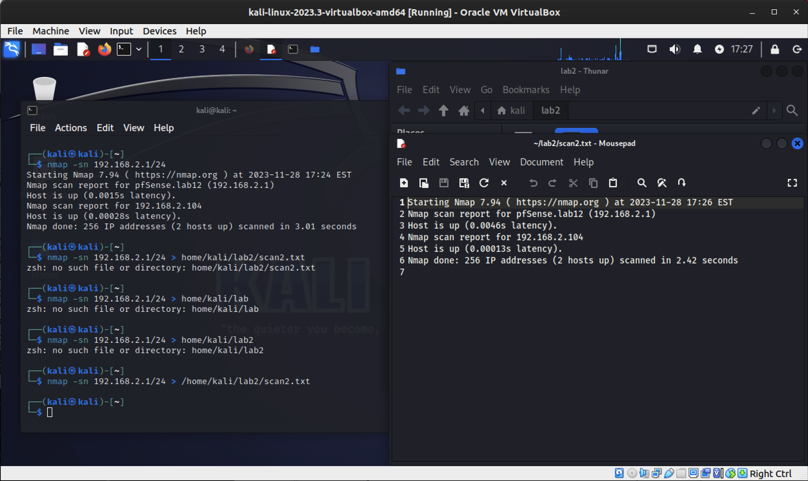
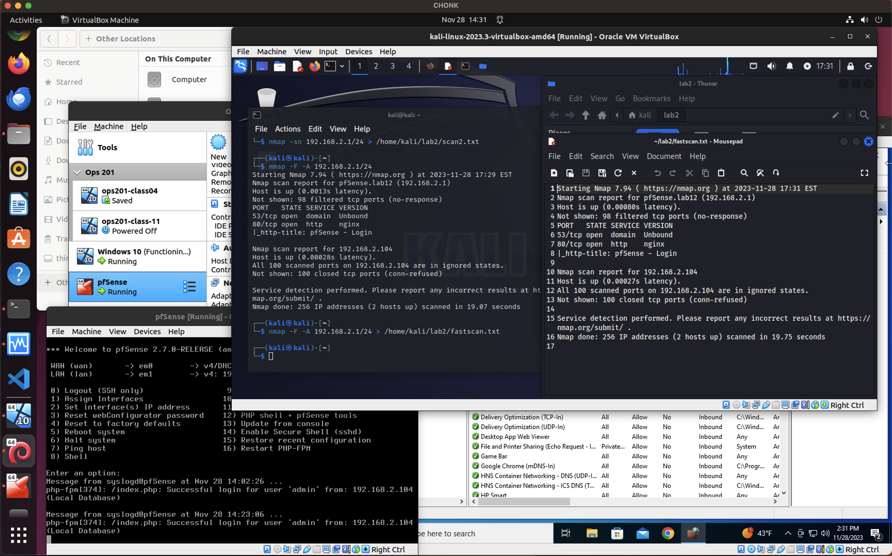
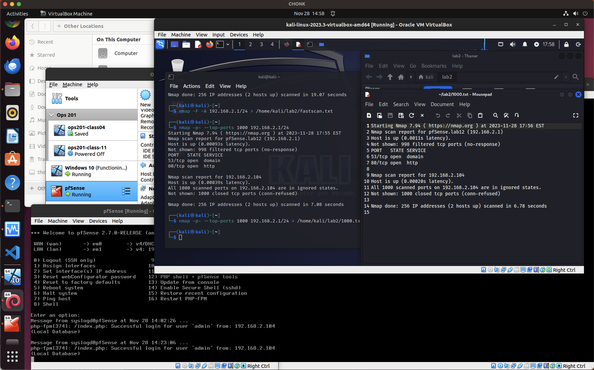
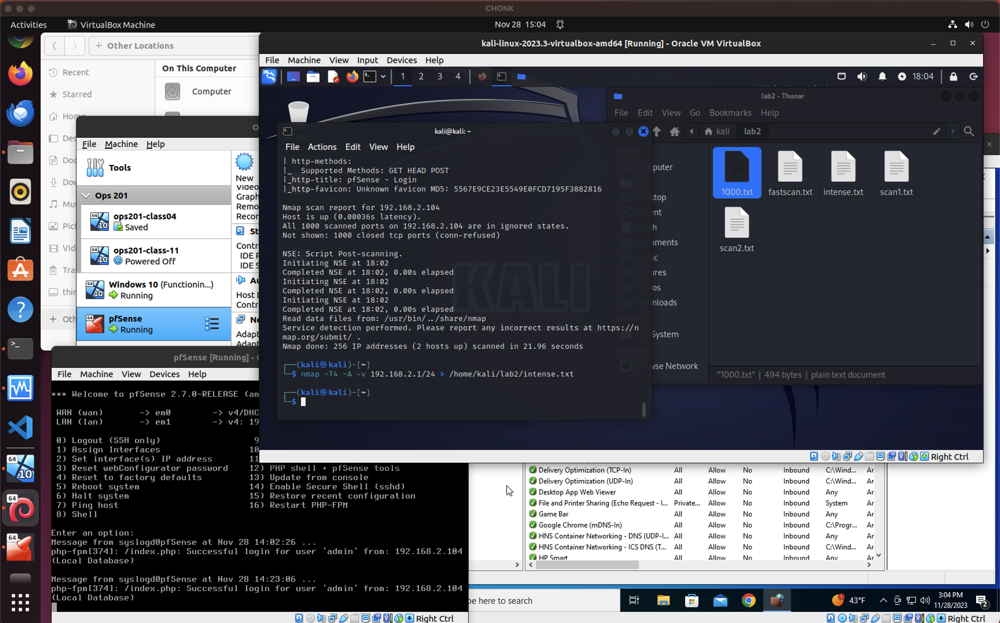

## Lab 2

**Part 1: Preparing a Network Environment and Staging Kali Linux**

| VM Setups | Network 1 Configuration             | Network 2 Configuration                | Purpose             |
|-----------|-------------------------------------|---------------------------------------|---------------------|
| pfSense   | - Bridged Adapter, eno1, intent     | - Internal Network, intent            | Firewall and routing |
| kali      | - Internal Network, intent           |                                       | Penetration testing  |
| win10     | - Internal Network, intent           |                                       | General Windows VM  |

**Part 2: Port Scanning with nmap**
**Scan for all hosts**
`nmap -sn pfsense > /home/kali/lab2/scan1.txt`

- In technical terms this seems to be a ping scan with additional information including latency, DNS records, and a status report.
- The scan did not find the Windows 10 VM at 192.168.2.103.
- Why?  I only told it to scan pfsense and not the IP Address Range.
- Why would I perform this particular scan? To see all hosts that are up and running.

`nmap -sn 192.168.2.1 > /home/kali/lab2/scan2.txt`

- This scan found all hosts on the network
- Why?  I told it to scan the entire network this time.

**Fast, Aggressive Scan**
`nmap -F -A 192.168.2.1/24 > /home/kali/lab2/fastscan.txt`

- In technical terms this seems to perform a fast scan of the target hosts which includes version detection, OS detection, script scanning while remaining focused on common ports.
- This scan seems to have been successful in finding all hosts on the network.
- Why?  I told it to scan the entire network this time.
- Why perform this scan?  To check all ports on all hosts across the network. This is a good scan to perform when you are not sure what you are looking for.

**Scan the 1000 most common ports on each host**
`nmap -p- --top-ports 1000 192.168.2.1/24 > /home/kali/lab2/1000ports.txt`

- In technical terms this scan is performed on the top 1000 ports on each host in the specified network.
- This scan succeeded in scanning ports taht were not in ignored states.
- Why? At this stage I feel it did its job to the level of knowledge I have
- Why perform this scan?  This seems like a good way to catch low hanging vulnerabilities on the network.

**Scan with Intensity, or Instense Scan**
`nmap -T4 -A -v 192.168.2.1/24 > /home/kali/lab2/intense.txt`

- In technical terms this performs an intense scan on all hosts, including version detection, OS detection, and script scanning wiht faster timing and more detailed output than the 1000 port or fast scan.
- This scan seems to have been successful.
- Why? The report is more detailed, the scan took almost 3x as long as before.
- If this picked up a port with a script running that was not authorized by the sysadmin team then you could have a potential vulnerability.  Interesting to consider the applications of such a scan.

**Slow, Comprehensive Scan**
`nmap -p- -T4 -A 192.168.2.1/24 > /home/kali/lab2/slow.txt`