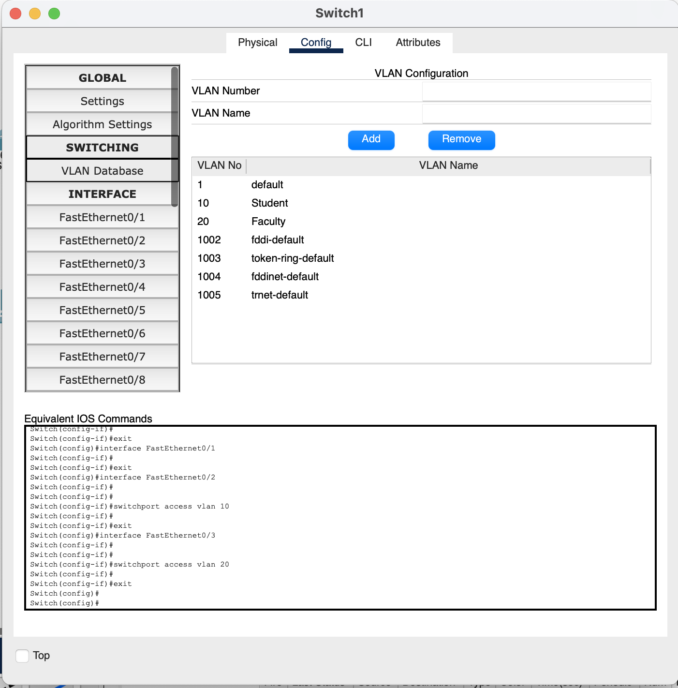

### Lab 3

**Network Segmentation**

**Scenario**

Modern switches use virtual local-area networks (VLANs) to improve network performance by separating large Layer 2 broadcast domains into smaller ones. VLANs can also be used as a security measure by controlling which hosts can communicate. In general, VLANs make it easier to design a network to support the goals of an organization.

VLAN trunks are used to span VLANs across multiple devices. Trunks allow the traffic from multiple VLANS to travel over a single link, while keeping the VLAN identification and segmentation intact.

In this lab, you will create VLANs on both switches in the topology, assign VLANs to switch access ports, verify that VLANs are working as expected, and then create a VLAN trunk between the two switches to allow hosts in the same VLAN to communicate through the trunk, regardless of which switch the host is actually attached to.

[Download Cisco Packet tracer for your OS](https://skillsforall.com/resources/lab-downloads)

**Task 1: Build the Network and Configure Basic Device Settings**

**Task 2: Configure VLANS and assign switch ports**

**Task 3: Configure Trunking**

**Other Visuals**

