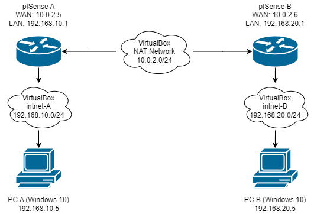

# Lab Instructions

## Part 1: Staging two networks

For this lab, you’ll need to deploy a second pfSense VM if you have not done so already.

**The first network should include:**
- pfSense 1
- Windows 10

**The second network should include:**
- pfSense 2
- Any VM with a web browser (Windows 10, Kali, etc.)

The below diagram is an example of how one’s design might turn out:

## Part 2: Configuring pfSense

Next, prepare both pfSense devices to handle the VPN connection.

**Include screenshots of each option you configure.**

*Hint: in System > General Setup, under webConfigurator, you can change the “Theme” of the web GUI of one pfSense, to make differentiating between your screenshots easier.*

1. Disable the default blocking of Private Networks and Bogon Networks to allow pfSense routers to respond to pings on the WAN:
   - Navigate to Interfaces > WAN, and scroll to the bottom
   - Uncheck the boxes for “Block private networks and loopback addresses” and “Block bogon networks”

   **pfsense b**
   

   **pfsense a**
   

2. Set logging to verbose so you can see more information about the tunnel’s various handshakes. The steps are:
   - Navigate to VPN > IPsec, then select then Advanced Settings tab
   - Set IKE SA, IKE Child SA, and Configuration Backend to Diag
   - Set all other log settings to Control
   - Click Save

   **pfsense b**
   

   **pfsense a**
   

**VPN tunnel specifications:**

**Phase 1**
- Protocol: IKEv2
- Interface: WAN
- Remote Gateway: the WAN IPv4 address of the other router
- Method: Mutual PSK (Preshared Key)
- Encryption: AES 256-bit
- Lifetime: 28800 sec

**Phase 2**
- Mode: Tunnel IPv4
- Local Network: LAN subnet
- Remote Network: the subnet address of the LAN on the other router
  - This is a subnet address, e.g., 10.0.2.0/24, which is different from a gateway address such as 10.0.2.1
- Protocol: ESP
- Encryption: AES 256-bit
- PFS Key Group: 14 (2048 bit)
- Lifetime: 3600 sec

**pfsense b phase 1 & 2**

**pfsense a phase 1 & 2**

**Firewall Rule specification:**
- Create corresponding rules on WAN and IPsec:
  - Action: Pass
  - Protocol: Any
  - Source: Any
  - Destination: Any

**pfsense b firewall rules**

**pfsense a firewall rules**

**Attempt to verify connectivity:**

- Navigate to Status > IPsec
- Press “Connect P1 and P2”
- The status screen should indicate “Established” for P1 and “Installed” for P2

**pfsense b status**

**pfsense a status**

**To troubleshoot connectivity, analyze the IPsec logs for clues as to what may be holding back connectivity from succeeding. Use search engines and reference the Netgate forums for help in evaluating where any misconfigurations could be.**

**Attempt to ping both the WAN IP and the LAN IP of the remote pfSense:**

- From pfSense:
  - Navigate to Diagnostics > Ping
  - Hostname: the LAN IPv4 address of the other router
  - Source Address: LAN

**pfsense b ping**

**pfsense a ping**

- From a host computer, use the terminal ping command as you normally would.

**host b ping**

**host a ping**

**If you’ve correctly shared your subnets in Phase 2, and allowed traffic in your various firewall rules, you should be able to ping the remote router’s subnet/LAN address. If not, tinker with your configuration some more.**

**Don’t worry about getting your assets in each LAN to ping over the tunnel just yet; we’ll get to that in the next lab.**

**Include a screenshot of your VPN configuration screen and validate successful connectivity by analyzing pfSense status indicators and system logs. Include screenshots that indicate successful VPN tunnel connectivity.**

## Part 3: Topology

Use Draw.io to create a network topology similar to the diagram above.

For each device on the network, include:

- IP addresses for each NIC
- Host names
- Host Operating Systems

Include a screenshot of your topology here, and save your topology for use in the future. You will need it for the next lab.

**Leave your VirtualBox network as-is! You’ll need it for the next class, so don’t delete anything (especially that VPN tunnel)!**

**Step By Step for the pfSense VM setup**

pfSense A
- Adapter 1
  - NAT Network
- Adapter 2
  - Internal Network
    - intnet 0

pfSense B
  - NAT Network
  - intnet 1

VM 1 (Kali)
- Vbox Net 0

VM 2 (Ubuntu or Win10)
- Vbox Net 1

VM > Tools >  Network > on the bottom disable DHCP

pfSense A 
- WAN: 10.0.2.7/24
- LAN: 192.168.2.1/24
- Same steps as pfSense B but use 192.168.100.2 and 192.168.100.100

pfSense B
- WAN: 10.0.2.8/24
- LAN: 192.168.3.1/24
- Option 2: Set Interface IP ADdresses
  - 2 for LAN
    - Confi IPv4 address LAN DHCP? No
    - Enter IP address
    - Bit count > 24
    - For LAN press enter
    - Config IPv6 > No
    - Press enter
    - Enable DHCP server on LAN? y
      - enter start address: 192.168.200.2
      - enter end address: 192.168.200.100
    - Revert to HTTP as webConfigurator protocol? y
    - Press enter

Host Win10: 192.168.2.103

Host Kali: 192.168.3.100