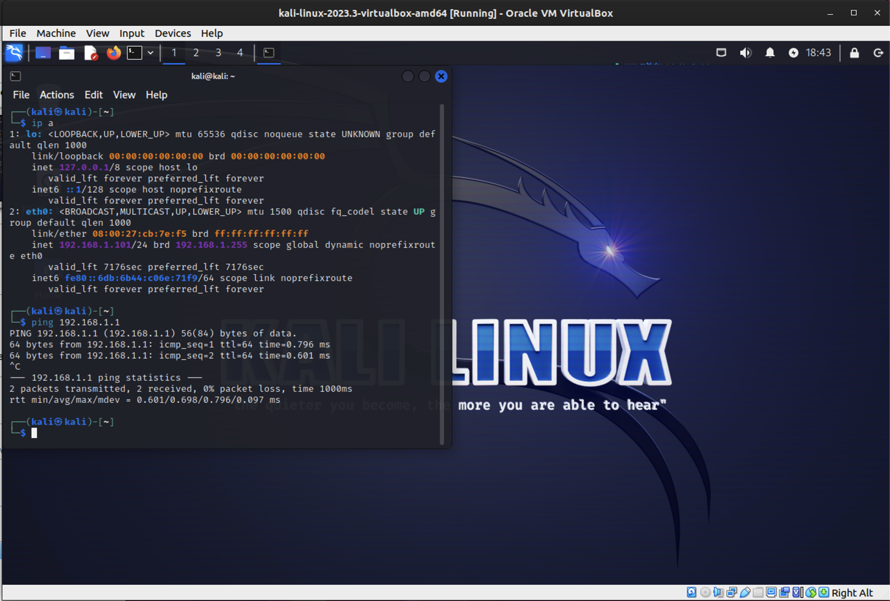

Submitting in order to submit later.

# Lab: RADIUS Authentication

## Overview

RADIUS (Remote Authentication Dial-In User Service ) is a network management protocol facilitating AAA (Authentication, Authorization, and Accounting) management for network users. In this type of configuration, the NAS (Network Access Server) brokers authentication requests and acts as the network's gatekeeper.

## Scenario

GlobeX's MSSP, Secutronix, informed you this morning that a network intrusion was detected. "You've got someone poking around your network!" the Secutronix rep, Sarah, explained. "Traffic logs indicate this was a wired connection. Somebody got onsite and used a wallport. We'll have to perform a deeper investigation. Until then, as a precaution, I recommend deploying additional network security systems. Have you tried TACACS+ or RADIUS? You might be able to implement wired network authentication that way."

## Prerequisites

- A pfSense VM in VirtualBox, free from configuration settings from previous labs
- A user endpoint VM in VirtualBox (any existing Windows 10 or Linux VM)

## Objectives

- Enable a Captive Portal on pfSense
- Create a local user and group on pfSense which can login through the Captive Portal
- Install the FreeRADIUS package on pfSense
- Configure FreeRADIUS and connect it to a local Authentication Server
- Reconfigure the Captive Portal to authenticate using FreeRADIUS 
- Provide detailed documentation of your configuration

## Resources

- [Video - Advanced Captive Portal on pfSense](https://www.netgate.com/resources/videos/advanced-captive-portal-on-pfsense.html){:target="_blank"}
- [Video - How to configure captive portal and freeRadius on pfsense 2.4.2 server](https://www.youtube.com/watch?v=qCTsyW65WbA){:target="_blank"}
- [Netgate - RADIUS Authentication Servers](https://docs.netgate.com/pfsense/en/latest/usermanager/radius.html#authservers-radius-config){:target="_blank"}
- [How to Set Up a Radius Server on pfSense](https://turbofuture.com/internet/How-to-Set-Up-a-Radius-Server-on-pfSense-Using-the-FreeRadius-Package){:target="_blank"}

## Tasks

Be sure to carefully document all configuration settings and passwords used in this lab.

### Part 1: Topology 1/2

Read through the entire lab and use Draw.io to create an appropriate topology of the network you expect to construct. Include as many details as you can such as computer names, OS types, IP addresses, etc. Include a screenshot of this initial topology.

Topology

### Part 2: Staging

Submit detailed documentation regarding all of the configurations in this section.

1. First you will need a fresh pfSense VM, free from configuration settings from previous labs. You can reset an existing instance to factory settings (Diagnostics / Factory Defaults), revert to a baseline snapshot, import a fresh instance from a baseline OVA backup, or install pfSense on a new VM. However you achieve this, it is important to start from a clean baseline to avoid complications.

**Setting Up a New pfSense**
- Option 2 sets up the LAN/WAN interface
- 2 for LAN
  - Config IPv4 address LAN interface via DHCP? N
  - Enter the new LAN IPv4 address (this is a gateway address): 192.168.1.1
  - Enter the new LAN IPv4 subnet bit count (1 to 30): 24
  - For a LAN, press <ENTER> for none: <ENTER>
- Config IPv6 address for LAN interface via DHCP6? N
  - <ENTER> for none
- Do you want to enable the DHCP server on LAN? (y/n) `this sets the ip address range for the LAN`: Y
  - Enter the start address of the IPv4 client address range: 192.168.1.100
  - Enter the end address of the IPv4 client address range: 192.168.1.200
- Option 7 to ping google to verify internet connection: 8.8.8.8

    On the pfSense VM, configure the WAN network adapter to NAT Network and the LAN adapter to Internal Network.

pfSense 192.168.1.1 setup and pinging 8.8.8.8

2. Second you will need a user endpoint VM with a GUI (Windows 10 or Kali) for configuring pfSense and testing the Captive Portal.

    On the user endpoint VM, configure the network adapter to match the LAN adapter of pfSense (should be set to the same Internal Network).

Kali VM 192.168.1.101 setup pinging 192.168.1.1

### Part 3a: Captive Portal

Submit detailed documentation regarding all of the configurations in this section.

- In Services > Captive Portal, add a new captive portal zone
- Enable the captive portal and configure it as follows:
  - Interfaces: LAN
  - Authentication Method: None

Captive Portal via pfSense GUI

- On the same VM that you are using to access the pfSense GUI, use your browser to navigate to `http://info.cern.ch` and observe what happens

CERN website via Kali VM

  > Please note that we have not enabled https for the captive portal, so it will work best with http addresses
- Attempt to login to the portal

Captive Portal login via Kali VM through http://info.cern.ch

- Navigate to Status / Captive Portal and disconnect the host
  - Done by clicking the Disconnect button below the "Users Logged In" table

### Part 3b: Captive Portal Authentication

Submit detailed documentation regarding all of the configurations in this section.

- In System > User Manager:
  - Create a new user
    - username: lab8
    - password: ImNotTellingYou12345678()

New User via pfSense GUI

  - Create a new group and grant it only captive portal privileges
    - Group name: lab8
    - Scope: Local

New Group via pfSense GUI

- Use Diagnostics > Authentication with the Local Database to test that the account is usable

- Return to Services > Captive Portal and make the following changes to the zone:
  - Authentication Method: Use an Authentication Backend
  - Authentication Server: Local Database (the only option, but you still must select it)

Captive Portal Authentication Method via pfSense GUI

- Navigate back to `http://info.cern.ch` and login with the new user you just created
  > If the CERN website remains in the browser instead of loading the authentication portal, try opening your browser's settings and clearing the cached web content

Captive Portal login via Kali VM through http://info.cern.ch

- Why did the captive portal change? How is pfSense authenticating this user?
  - The captive portal changed because we changed the authentication method to use an authentication backend. pfSense is authenticating this user by using the local database.

- Can you use the pfSense admin user to access the portal as well? Why or why not?
  - No.  The admin is not in the group that we created for the captive portal.

Group lab8 has 1 member, lab8.  Admin is not in the group.

### Part 4: Deploy FreeRADIUS

Submit detailed documentation regarding all of the configurations in this section.

- Navigate to System > Package Manager and install the FreeRADIUS package
- In Services > FreeRADIUS, do the following:
  - Create a User
    - Username: lab8
    - Password: ImNotTellingYou12345678()

FreeRADIUS User via pfSense GUI

  - Create a Client with the loopback address as its IP address
    - IP address: 127.0.0.1
    - Choose a Client Shared Secret and include it here (you'll need it in a moment)
      - lab8

Creat Client via pfSense GUI

Client from pfSense GUI

  - Create an Interface (default settings are fine)
    - Done

- Under System > User Manager, select the Authentication Server tab and create a server with the following settings:
  - Type: RADIUS
  - IP address: the loopback address, the same as with the FreeRADIUS Client
  - Shared Secret: the same as above
    - Complete

Authentication Server via pfSense GUI

- In Diagnostics > Authentication, test the new FreeRADIUS user you just created to confirm it is working

Diagnostics > Authentication via pfSense GUI

### Part 5: Integrating FreeRADIUS with Captive Portal

Next, let's try and integrate FreeRADIUS.
Submit detailed documentation regarding all of the configurations in this section.

- Return to Services > Captive Portal and change Authentication Server from Local Database to the new server you just created
- Try logging in with the pfSense local user you created in Part 2b -- were you able to log in? Why or why not?
- Try logging in with the FreeRADIUS user you just created -- did it work? Why or why not?

FreeRADIUS login to info.cern.ch via Kali VM

FreeRADIUS login to info.cern.ch via Kali VM

### Part 6: Logs

As with any system you deploy be prepared to troubleshoot it!

- Look up the FreeRADIUS `radtest` command
  - What is the command used for?
    - The radtest command is a utility used in FreeRADIUS for testing and debugging RADIUS authentication and accounting servers. It allows you to simulate RADIUS authentication requests to check if your RADIUS server is correctly configured and functioning.
  - What is the command's syntax?
    - `radtest username password radius-server nas-port-number secret`
    - `radtest lab8 lab8 127.0.0.1 1812 lab8`
  - Include a screenshot of using `radtest` to test your FreeRADIUS user

Using `radtest` to test FreeRADIUS user via pfSense terminal

  - Can you use `radtest` to check a pfSense local user?
    - I don't believe so.  This is specific to the FreeRADIUS server.

- Identify the system logs in pfSense
  - Include a screenshot of logs related to FreeRADIUS and/or the Captive Portal
    - Status > System Logs > Package Logs > `No packages with logging facilities are currently installed.`

Screeshot of the logs related to Status > System Logs > Authentication > Captive Portal Auth

  - What events do you think these logs recorded?
    - It looks like it recorded logins and configurations in the lab8 zone.

  - Do the system logs include authentication attempts? How about failed authentication attempts?
    - It appears that it does show authentication attempts.  I did not have failed attempts during the lab after setting up this Auth Method.

- Look up AAA Management as it relates to computer security
  - What does it mean?
    - AAA stands for Authentication, Authorization, and Accounting.  It is a framework for intelligently controlling access to computer resources, enforcing policies, auditing usage, and providing the information necessary to bill for services.

  - Explain in your own words how this RADIUS configuration facilitates AAA management
    - The RADIUS configuration facilitates AAA management by allowing us to authenticate users, authorize them to access the network, and account for their usage.

Submit detailed documentation regarding all of the above configurations.

### Part 7: Topology 2/2

When the other tasks are complete, review the topology and update, revise, extend, or add details as necessary.

Topology

Was your initial topology accurate to the finished product? Why or why not?