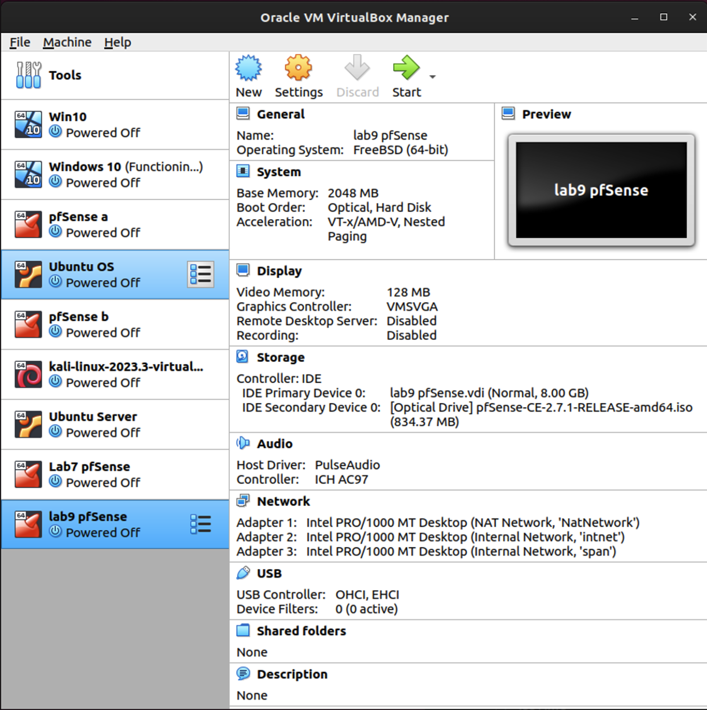
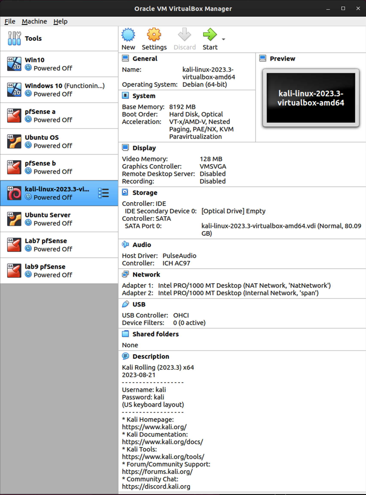
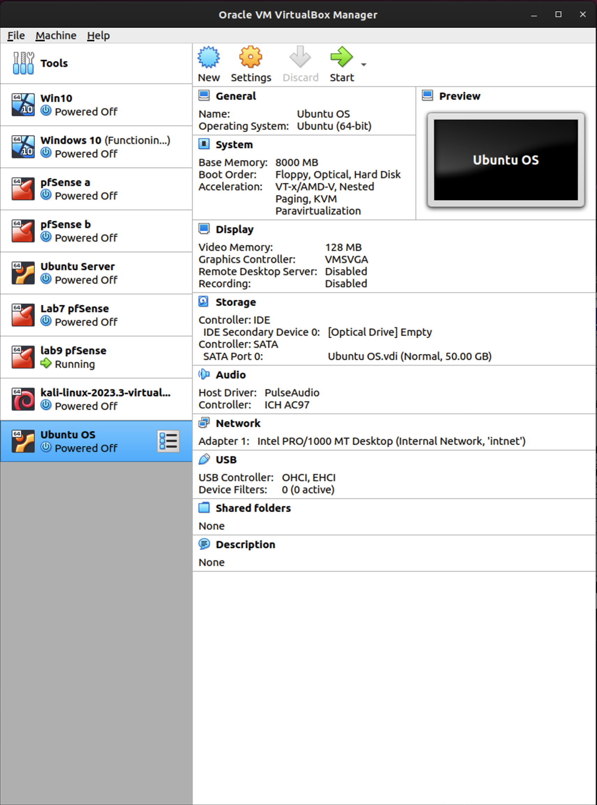

# Lab: Traffic Mirroring

## Overview

Configuring the network for optimal visibility by security tools is essential in the modern era. One method involves duplicating or "mirroring" network traffic to a sniffing tool. This allows the tool to monitor all traffic passing through the mirrored interface.

## Scenario

After the network intrusion incident, the GlobeX MSP, Secutronix, performed and in-depth review of GlobeX's primary LAN subnet and determined additional security measures would be necessary to detect such a threat in the future. Secutronix is about to deploy a new IDS (Intrusion Detection System) on the GlobeX network, but they're requesting that a "span port" be created that will mirror all traffic on the primary subnet interface.

## Prerequisites

- A pfSense VM in VirtualBox, free from configuration settings from previous labs
- A Kali VM in VirtualBox
- A user endpoint VM in VirtualBox (any existing Windows 10 or Linux VM)

## Objectives

- Create a span port on pfSense that mirrors the traffic from the LAN network interface
- Configure Kali Linux so that it can capture traffic on a dedicated sniffing port
- Live-capture LAN traffic using Wireshark on Kali Linux

## Resources

- [pfSense Docs - Interface Bridges](https://docs.netgate.com/pfsense/en/latest/bridges/index.html){:target="_blank"}

## Tasks

### Part 1: Topology 1/2

Read through the entire lab and use Draw.io to create an appropriate topology of the network you expect to construct. Include as many details as you can such as computer names, OS types, IP addresses, etc. Include a screenshot of this initial topology.

### Part 2: Staging

Submit detailed documentation regarding all of the configurations in this section.

1. First you will need a fresh pfSense VM, free from configuration settings from previous labs. You can reset an existing instance to factory settings (Diagnostics / Factory Defaults), revert to a baseline snapshot, import a fresh instance from a baseline OVA backup, or install pfSense on a new VM. However you achieve this, it is important to start from a clean baseline to avoid complications.

    - On the pfSense VM, configure the WAN network adapter to NAT Network and the LAN adapter to Internal Network.

    - Then enable a third network adapter and attach it to Internal Network. Create a new internal network named Span for this adapter.

      - Set Promiscuous Mode to Allow All on this Span adapter.

pfSense VM Setup


2. On your Kali VM, configure the network adapter to Internal Network and connect it to the same Span network as the new adapter on pfSense.

    - Set Promiscuous Mode to Allow All on this adapter.

Kali VM Setup


3. On the user endpoint VM, configure the network adapter to match the LAN adapter of pfSense (should be set to the same Internal Network). We will need this machine to generate traffic for us to capture.

Ubuntu VM Setup


### Part 3: Prepare a Span Port on pfSense

We want pfSense to mirror all LAN traffic to this connection

- In Interfaces / Assignments / Interface Assignments, add a new interface associated with the new network adapter
- Configure the new interface
  - Enable the interface
  - Give the interface an appropriate name (default is likely OPT1)
- In Interfaces / Assignments / Bridges, add a bridge with the following configuration:
  - Member Interfaces: LAN
  - Span Port: whatever interface you just created


### Part 4: Capture Packets with Kali

Now we will use Wireshark on Kali to sniff for network traffic on the `span` connection.

- Make sure another VM is connected on the LAN, and use it to ping `scanme.nmap.org`
  > Hint: you can make Windows 10 ping continuously by adding a `-t` flag, as in `ping scanme.nmap.org -t`
- On Kali, set Wireshark to capture traffic on the interface associated with the `span` connection we set up earlier
- Include a screenshot of pings out to `scanme.nmap.org` captured in Wireshark

### Part 5: Questions

- On pfSense, navigate to the Dashboard, and locate the list of active interfaces
  - Does the interface you created have an IP address?
- Disable all network devices on Kali *except* the `span` port connection
  - Does the traffic capture still work?
  - Why might you want to disconnect a sniffing machine in this way?
- On Kali, run
  ```
  sudo dhclient -r
  sudo dhclient
  ip a
  ```
  - Does Kali have any IP addresses?
- If niether Kali nor pfSense have an IP address on the `span` port connecting them, how is traffic being sent from pfSense and reaching Kali?

### Part 6: Topology 2/2

When the other tasks are complete, review the topology and update, revise, extend, or add details as necessary.

Was your initial topology accurate to the finished product? Why or why not?

## Submission Instructions

1. Create a new blank Google Doc. Include above assignment submission text and images within this Google Doc.
1. Name the document according to your course code and assignment.
   - i.e. `seattle-ops-201d1: Reading 01` or `seattle-ops-201d1: Lab 04`.
1. Add your name & date at the top of the Google Doc.
1. Share your Google Doc so that "Anyone with the link can view".
1. Paste the link to your Google Doc in the discussion field below and share an observation from your experience in this lab.
