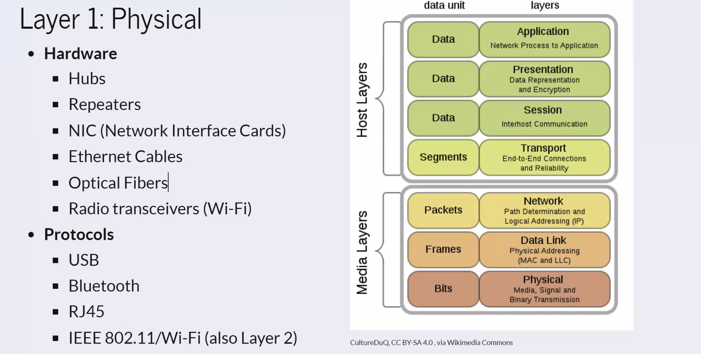
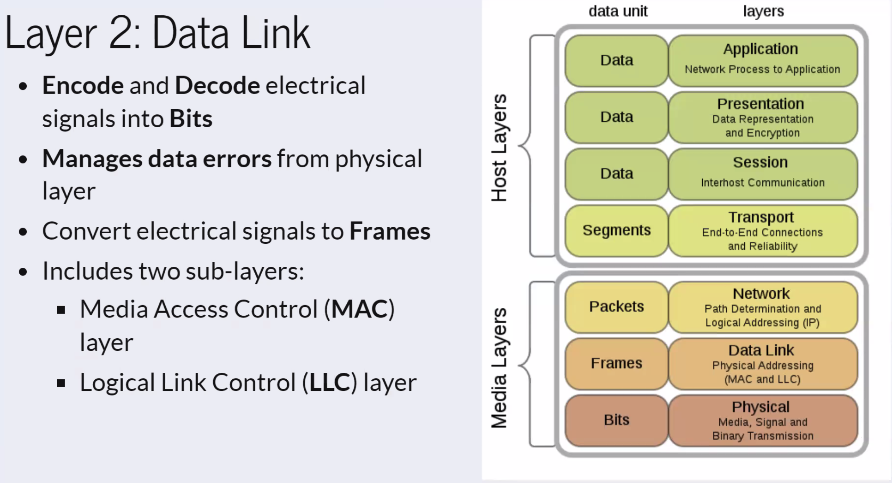
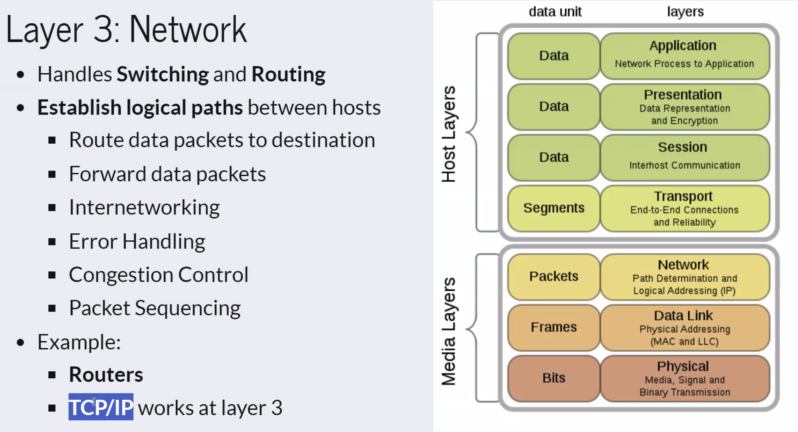
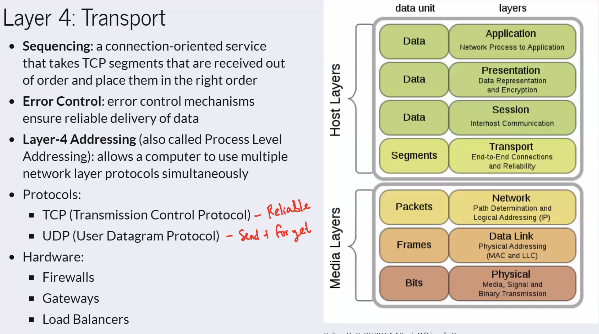

Layers of the OSI Model:

1. **Physical Layer (Layer 1)**: Responsible for physical connections, synchronization of bits, transmission rate, physical topologies, and transmission modes.
2. **Data Link Layer (Layer 2)**: Ensures error-free data transfer between nodes, framing, physical addressing (MAC addresses), error control, flow control, and access control.
3. **Network Layer (Layer 3)**: Handles data transmission between hosts in different networks, routing, logical addressing (IP addresses), and selecting the best path for data transmission.
4. **Transport Layer (Layer 4)**: Provides end-to-end delivery of data segments, acknowledgment, error handling, segmentation, reassembly, and uses port numbers for communication.
5. **Session Layer (Layer 5)**: Establishes, maintains, and terminates connections, synchronizes data, and controls dialog between systems.
6. **Presentation Layer (Layer 6)**: Translates and manipulates data formats for transmission, including encryption, decryption, and compression.
7. **Application Layer (Layer 7)**: Where network applications operate, producing data for transfer, offering access to the network, and displaying received information.

| # | Layer | Address Type | Data Type | Devices/Protocols | Mnemonic |
| - | ----- | ------------ | --------- | -------- | -------- |
| 7 | Application | | | HTTP, FTP, DNS, DHCP, Computer | Away |
| 6 | Presentation | | | ASCII, JPEG/GIF/PNG, Computer (Format) | Pizza |
| 5 | Session | | | SMB, SIP, Computer | Sausage |
| 4 | Transport | Logical Port Number | Segments | TCP, UDP, Gateway, Load Balancer | Throw |
| 3 | Network | IP Address (197.168.1.1) | Packets | Router, L3 Switch (VLAN) | Not |
| 2 | Data Link | MAC Address (00:0a:95:9d:68:16) | Frame (group of bits) | L2 Switch, Bridge | Do |
| 1 | Pysical | Physical Port ID (P1, P7, etc) | Bits (0s and 1s) | Cables, Hubs, Repeaters, NICs, etc | Please |

**Full Mnemonic: Please Do Not Throw Sausage Pizza Away**
 
**Layer 1-3 are hardware/physical layers**
 
**Layer 4-7 are software/protocol layers**
 
**Layer 5-7 do not have specific Address or Data Types associated with them**
 

**Some Port Stuff**
Port 22: Logical port for SSH
Port 80: Logical port for HTTP
Port 443: Logical port for HTTPS
