### Day 1

### Layers of the OSI Model:

1. **Physical Layer (Layer 1)**: Responsible for physical connections, synchronization of bits, transmission rate, physical topologies, and transmission modes.
2. **Data Link Layer (Layer 2)**: Ensures error-free data transfer between nodes, framing, physical addressing (MAC addresses), error control, flow control, and access control.
3. **Network Layer (Layer 3)**: Handles data transmission between hosts in different networks, routing, logical addressing (IP addresses), and selecting the best path for data transmission.
4. **Transport Layer (Layer 4)**: Provides end-to-end delivery of data segments, acknowledgment, error handling, segmentation, reassembly, and uses port numbers for communication.
5. **Session Layer (Layer 5)**: Establishes, maintains, and terminates connections, synchronizes data, and controls dialog between systems.
6. **Presentation Layer (Layer 6)**: Translates and manipulates data formats for transmission, including encryption, decryption, and compression.
7. **Application Layer (Layer 7)**: Where network applications operate, producing data for transfer, offering access to the network, and displaying received information.

| # | Layer | Address Type | Data Type | Devices/Protocols | Mnemonic |
| - | ----- | ------------ | --------- | -------- | -------- |
| 7 | Application | | | HTTP, FTP, DNS, DHCP, Computer | Away |
| 6 | Presentation | | | ASCII, JPEG/GIF/PNG, Computer (Format) | Pizza |
| 5 | Session | | | SMB, SIP, Computer | Sausage |
| 4 | Transport | Logical Port Number | Segments | TCP, UDP, Gateway, Load Balancer | Throw |
| 3 | Network | IP Address (197.168.1.1) | Packets | Router, L3 Switch (VLAN) | Not |
| 2 | Data Link | MAC Address (00:0a:95:9d:68:16) | Frame (group of bits) | L2 Switch, Bridge | Do |
| 1 | Pysical | Physical Port ID (P1, P7, etc) | Bits (0s and 1s) | Cables, Hubs, Repeaters, NICs, etc | Please |

**Full Mnemonic: Please Do Not Throw Sausage Pizza Away**
**4-1 Data Type Mnemonic: Some People Fear Birthdays (Segments, Packets, Frames, Bits)**
**4-1 Address Type Acronym: LIMP (Logical, IP, MAC, Physical)**
 
**Layer 1-3 are hardware/physical layers**
 
**Layer 4-7 are software/protocol layers**
 
**Layer 5-7 do not have specific Address or Data Types associated with them**
 

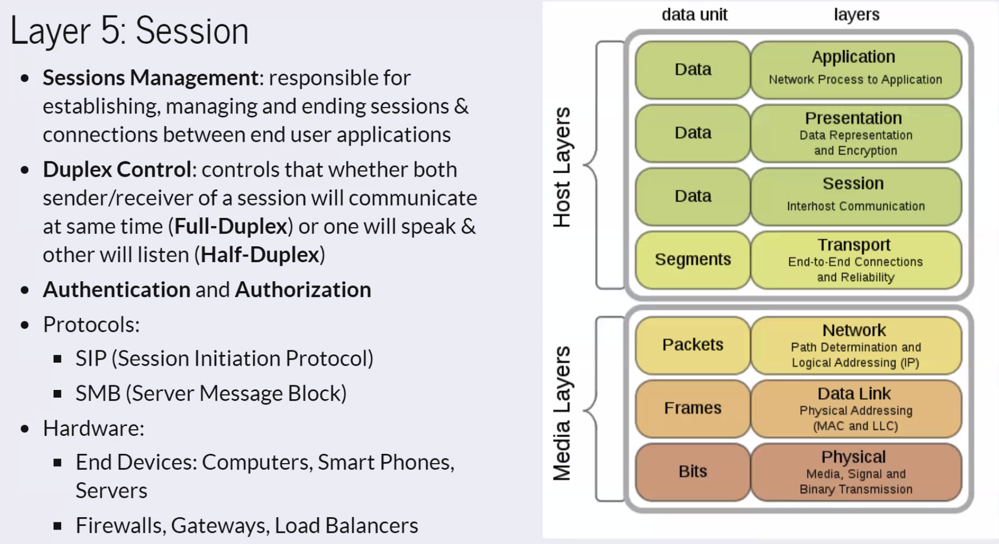
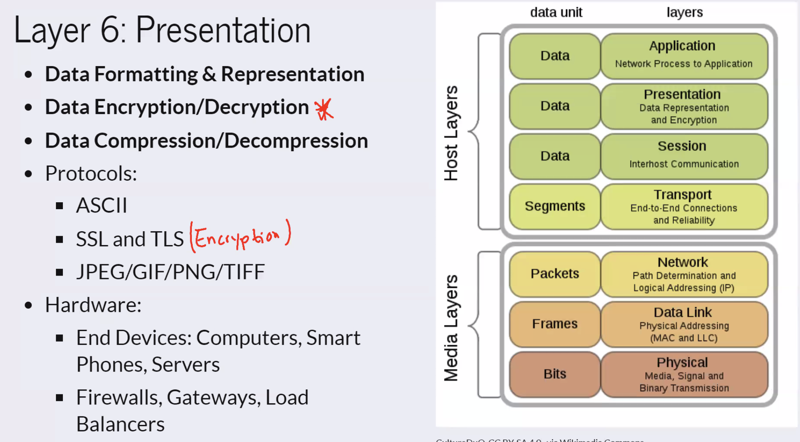
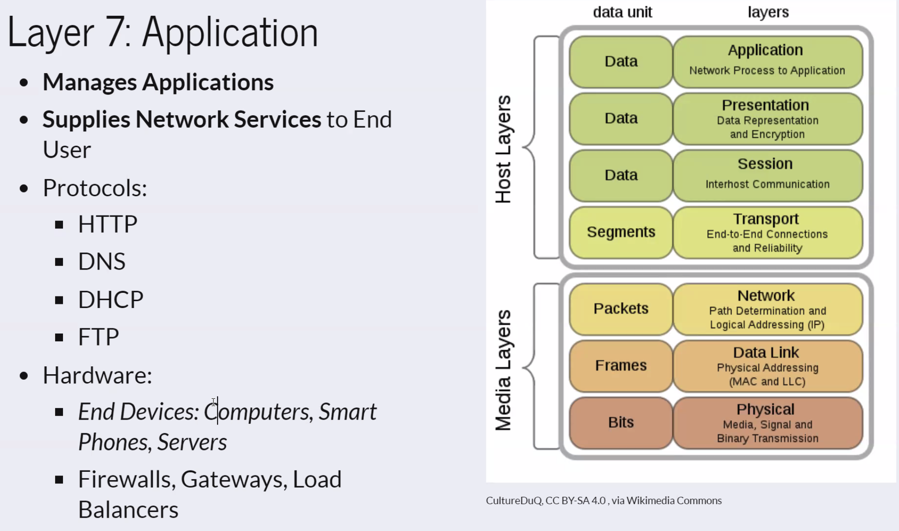

**Some Port Stuff**
Port 22: Logical port for SSH
Port 80: Logical port for HTTP
Port 443: Logical port for HTTPS

**1. List and describe the ports used for the following:**

| Service                   | Description                                                    | Protocol | Port(s) | Additional Info                                    |
|---------------------------|----------------------------------------------------------------|----------|---------|----------------------------------------------------|
| DHCP                      | Dynamic Host Configuration Protocol, assigns IP addresses     | UDP      | 67, 68  |                                                    |
| DNS                       | Domain Name System, translates domain names to IP addresses   | UDP      | 53      |                                                    |
| FTP                       | File Transfer Protocol, used for file transfers               | TCP      | 20, 21  | Data and control channels                         |
| HTTPS                     | HyperText Transfer Protocol Secure, sends/receives web pages  | TCP      | 443     | Encrypted                                          |
| HTTP                      | HyperText Transfer Protocol, sends/receives web pages         | TCP      | 80      | Unencrypted                                        |
| ICMP (Ping)               | ICMP, test connectivity to remote computer                   | ICMP     | Type 8  | Typically on port 0; blocked by firewalls          |
| NTP                       | Network Time Protocol, synchronizes system clocks            | UDP      | 123     |                                                    |
| RDP                       | Remote Desktop Protocol, view/control remote computer        | TCP      | 3389    | Encrypted                                          |
| SMB                       | Server Message Block, file and printer sharing                | TCP      | 445     | Commonly used in Windows file sharing              |
| SMTP                      | Simple Mail Transfer Protocol, sends email messages           | TCP      | 25      | Typically plaintext; SMTPS uses TLS on 587/465   |
| SFTP                      | SSH File Transfer Protocol, secure file transfers             | TCP      | 22      | Encrypted                                          |
| SSH                       | Secure Shell, secure remote access                             | TCP      | 22      | All traffic is encrypted, more secure than Telnet |
| Telnet                    | Telecommunication Network Protocol, allows remote access      | TCP      | 23      | Has security issues                               |

**TCP Handshake**
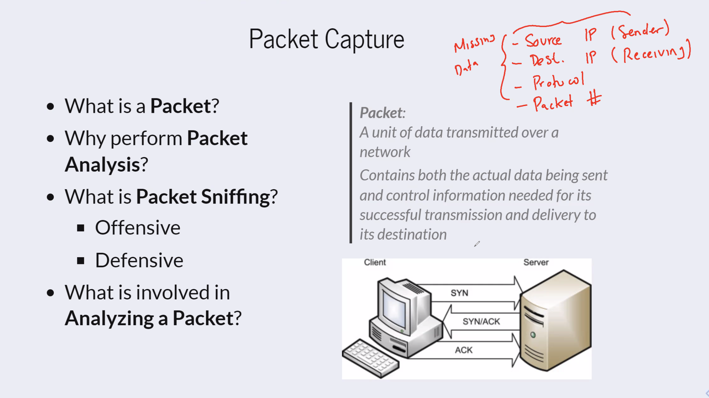
Step 1: SYN (synchronize) - Client sends a SYN packet to the server to initiate a connection.
Step 2: SYN-ACK (synchronize-acknowledge) - Server responds with a SYN-ACK packet to acknowledge the request.
Step 3: ACK (acknowledge) - Client sends an ACK packet to acknowledge the server's response.

### Day 2

**Date Scripting**

**Don't forget your shebang!**
`#!/bin/bash`

**Date and Time Format Codes:**

| Format | Description                                       | Example     |
|--------|---------------------------------------------------|-------------|
| %Y     | Year (4-digit)                                    | 2023        |
| %m     | Month (01-12)                                     | 03          |
| %d     | Day of the month (01-31)                          | 15          |
| %H     | Hour (00-23)                                      | 14          |
| %M     | Minute (00-59)                                    | 45          |
| %S     | Second (00-59)                                    | 22          |
| %A     | Full weekday name (e.g., Sunday)                   | Monday      |
| %B     | Full month name (e.g., January)                   | September   |

**Shell Commands and Variables:**

| Command/Variable                     | Description                                     | Example                      |
|--------------------------------------|-------------------------------------------------|------------------------------|
| `echo $date`                          | Prints the date                                 | (Output varies)              |
| `year=$(date +%Y)`                    | Assigns the year to a variable                 | `$year` contains the year    |
| `month=$(date +%m)`                   | Assigns the month to a variable                | `$month` contains the month  |
| `day=$(date +%d)`                     | Assigns the day to a variable                  | `$day` contains the day      |
| `echo "Today is $month/$day/$year"`    | Prints the date in the format of MM/DD/YYYY    | Today is 03/15/2023          |
| `echo "Current Date: $(date +%m/%d/%Y)"` | Prints the date in the format of MM/DD/YYYY  | Current Date: 03/15/2023     |

**Append to a file**
`echo "Today is $month/$day/$year" >> test-date.txt` - appends the date to the test-date.txt file
`mv test-date.txt test-date-$(date +%m-%d-%Y).txt` - renames the file to include the date

**Types of Protocols and Ports I need to know to pass CompTia Network+**

**2. List of Protocols with Descriptions and Port Information:**

| Protocol               | Description                                     | Connection Type    | Associated Ports (if any)                   |
|------------------------|-------------------------------------------------|--------------------|--------------------------------------------|
| ICMP (Internet Control Message Protocol) | Used for network diagnostics and error reporting. | Connectionless    | N/A                                        |
| UDP (User Datagram Protocol)            | Provides a connectionless and lightweight communication mechanism. | Connectionless    | Various, e.g., DNS (53), NTP (123)         |
| TCP (Transmission Control Protocol)    | Provides reliable, connection-oriented communication. | Connection-oriented | Various, e.g., SSH (22), HTTP (80)        |
| IP (Internet Protocol)                 | A fundamental protocol for routing packets across networks. | N/A                | N/A                                        |
| Connection-oriented vs Connectionless   | Indicates whether a protocol establishes a connection before data transfer (connection-oriented) or sends data without establishing a connection (connectionless). | N/A | N/A                                      |

**Network Enumeration**

Port Scanning: The process of sending packets to specific ports on a host and analyzing the responses to learn more about the host and its services.  Can tell us what ports are open, what services are running, and what operating system is running, and IP addresses of other hosts on the network.

Network Enumeration uses further techniques to gather information about a network, such as:

- DNS zone transfers: A DNS zone transfer is the process of copying DNS data from a master DNS server to a slave DNS server.  This allows the slave server to have an exact copy of the DNS records from the master server.  This is useful for load balancing and redundancy.
- SNMP queries: Simple Network Management Protocol (SNMP) is a protocol for monitoring and managing network devices.  SNMP queries can be used to gather information about network devices, such as routers, switches, and printers.
- NetBIOS queries: NetBIOS is a protocol that allows applications on different computers to communicate within a local area network (LAN).  NetBIOS queries can be used to gather information about Windows computers on a network.
- LDAP queries: Lightweight Directory Access Protocol (LDAP) is a protocol for accessing and maintaining directory services over an IP network.  LDAP queries can be used to gather information about users, groups, and computers on a network.
- NTP queries: Network Time Protocol (NTP) is a protocol for synchronizing the clocks of computers over a network.  NTP queries can be used to gather information about the time and date of computers on a network.
- SMTP queries: Simple Mail Transfer Protocol (SMTP) is a protocol for sending email messages.  SMTP queries can be used to gather information about email servers on a network.

**Nmap Security Scanner:** A free and open-source network scanner used to discover hosts and services on a computer network by sending packets and analyzing the responses.  It can be used for network inventory, managing service upgrade schedules, and monitoring host or service uptime.
- Enumerate hosts on a network
- Enumerate ports open on a host
- Operate more discreetly or aggressively
- Perform service fingerprinting to determine waht software (OS or apps) might be running on the target host

**Nmap Syntax**

`nmap [options] {target specification}`
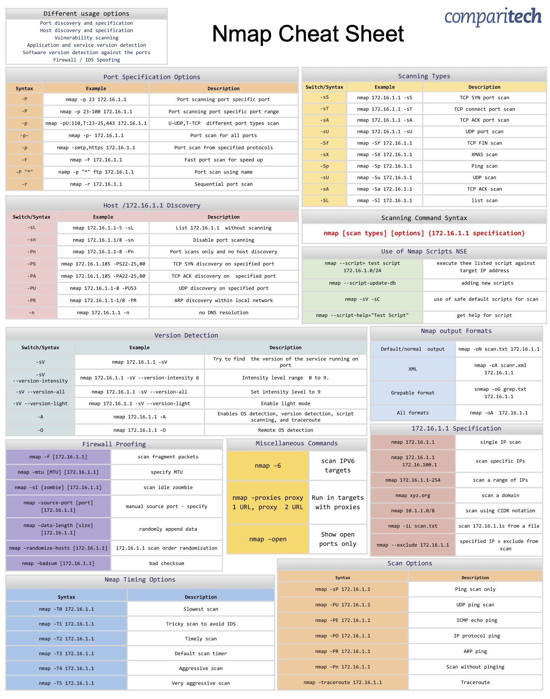

### Day 3

**chmod options (permissions)**

| Command           | Value | Numeric Value | Effect                 |
|-------------------|-------|---------------|------------------------|
| `chmod +r file`   | r     | 4             | Add read permission    |
| `chmod +w file`   | w     | 2             | Add write permission   |
| `chmod +x file`   | x     | 1             | Add execute permission |
| `chmod -r file`   | r     | 4             | Remove read permission |
| `chmod -w file`   | w     | 2             | Remove write permission|
| `chmod -x file`   | x     | 1             | Remove execute permission|
| `chmod 755 file`  | rwx   | 7             | Owner: rwx, Group: r-x, Others: r-x |
| `chmod 644 file`  | rw-   | 6             | Owner: rw-, Group: r--, Others: r-- |
| `chmod 600 file`  | rw-   | 6             | Owner: rw-, Group: ---, Others: --- |

permissions: rwxrwxrwx (owner, group, others)

you can set folder/dir level permissions and then also set permissions for specific files within the folder/dir.  A folder might have full rwx permissions but a sensitive file may only have rw permissions or even no permissions for the group or others.

**Subnetting**

Network: is a logical collection of contiguous IP addresses that share the same network ID.  A network is also known as a subnet.

Subnet: is literally a "sub-network", a netwrok inside a larger network

IP Address: includeds two parts
- Network ID: identifies the network. The network ID is the same for all hosts within the network.
- Host ID: identifies the host. The host ID is unique within the network.

Subnetting involves "borrowing" bits from the Host ID and adding them to the Network ID.

Subnetting: logically breakin an addressable block of IP addresses into mulitple, smaller addressable blocks

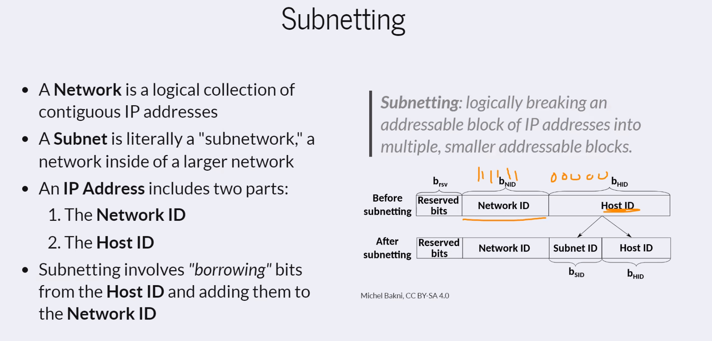
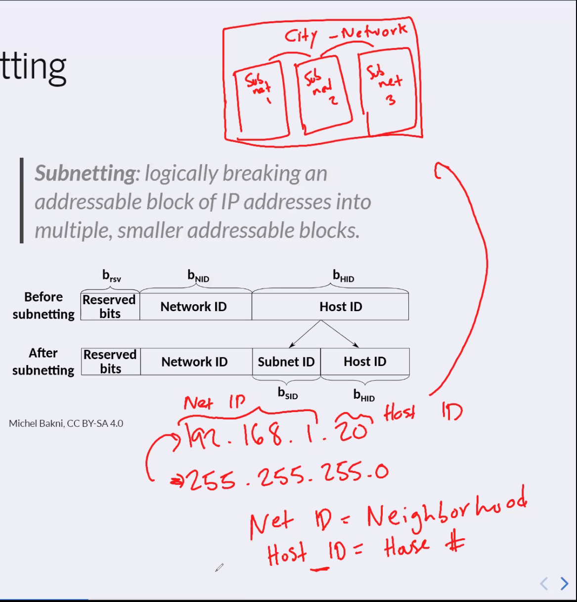

Subnet Mask: is a 32-bit number that identifies the network ID and host ID of an IP address.  It is used to determine whether a host is on the local network or a remote network.
- Also known as a netmask, indicates which bits are "masked" to find the Host ID.
- Example: 255.255.255.0 in Decimal or 11111111.11111111.11111111.00000000 in Binary

CIDR Notation: is a shorthand notation for representing a subnet mask.  It is used to indicate the number of bits in the subnet mask.
- represents the number of binary bits (counted from left to right) which belong to the Network ID

Example:
- IP Address: 185.210.25.69/24
- Subnet Mask: 255.255.255/0
- Network ID: 185.210.25
- Host ID: 69
- Network (Subnet ID): 185.210.25.0
- First Host IP Address: 185.210.25.1
- Last Host IP Address:: 185.210.25.254
- Broadcast Address: 185.210.25.255
- Next Network (Subnet ID): 185.210.26.0
- Valid Host IP Addresses: 254

Example Subnet Mask Math:
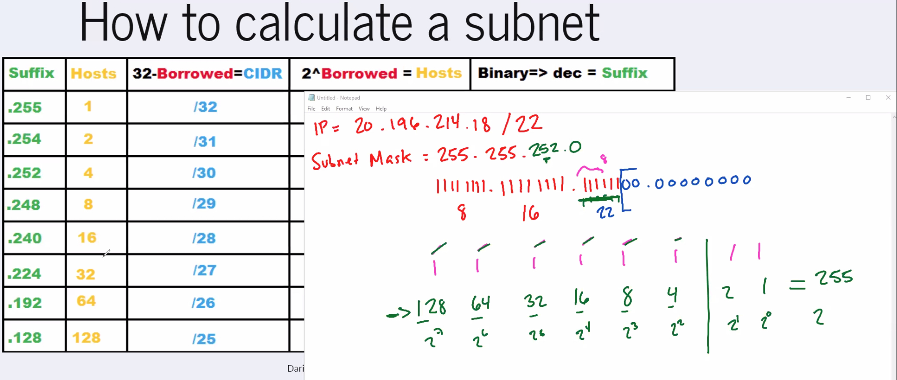

Another Example of Subnet Mask Math:
- IP: 20.196.214.18/22
- Subnet Mask: 255.255.252.0
- 11111111.11111111.11111100.00000000
- ......8..........16.......22        
- Size of Subnet: 256 - 252 = 4
- Subnet: 20.196.212.0
- First Host: 20.196.212.1
- Last Host: 20.196.215.254
- Broadcast: 20.196.215.255
- Next Subnet: 20.196.216.0
- Number of Subnets: 64
- Hosts per Subnet: 1022 
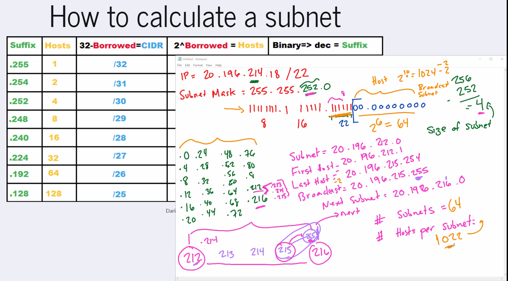

**Network Segmentation**

Reasons to implement network segmentation:
- Performance
- Security
- Regulatory Compliance
  - NIST SP 800-53
  - NIST SP 800-171
  - and more...

Network Segmentation: the process of dividing a network into smaller networks, called subnets.  Each subnet is a separate network segment.

Interfaces can be the physical ethernet ports on a router, but can also be represented virtually.
- commonly the lowest number is WAN, the rest tend to be LAN. Configurable.
- x0 is WAN, x1 is LAN, x2 is LAN, etc.
- ens0, ens1, ens2, etc.
- We can use these interfaces to divide the netwrok using different subnets and DHCP scopes.

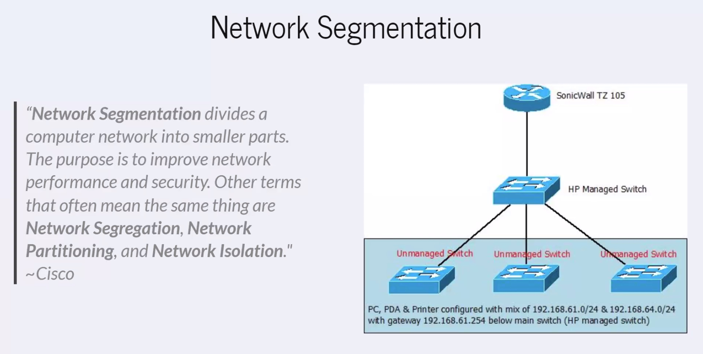

Microsegmentation: the process of dividing a network into even smaller networks, called microsegments.  Each microsegment is a separate network segment.
- microsegmentation uses much more information in segmentation policies like application-layer information. It enables policies that are more granular and flexible to meet the highly-specific needs of an organization or business application. ~Cisco

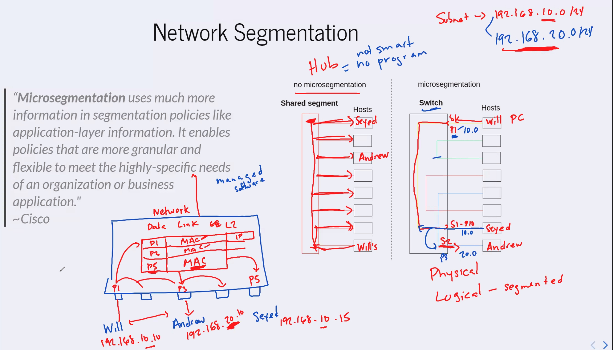

Segmentation Methods:
- Logical Semgentation relies on sofware or packet header info to separate netwrok traffic.
- examples: VLANs, VPNs, and tunnels
- VLAN: a virtual LAN that logically separates a physical LAN into multiple virtual LANs.  VLANs are commonly used to separate traffic from different departments or different security zones.

### Day 4

**Cisco Packet Tracer**

Switch CLI Commands to enable trunk
- `enable`
- `configure terminal`
- `interface gigabitethernet 0/1` or `interface FastEthernet 0/1`
  - 0/1 is the port number
- `switchport mode trunk`
- `end`
- `write memory`

Router Setup - (We need to setup the switch to router connection as a trunk)
- `enable`
- `configure terminal`
- `interface fastethernet 0/0`
- `no shutdown`
- `exit` 
  - moves up one level out of the interface and back to router config
- `interface fastethernet 0/0.10`
  - 0/0.10 is the subinterface
  - you will see fastethernet 0/0.10 state changed to up
- `encapsulation dot1q 10`
  - 10 is the VLAN ID
  - encapsulation dot1q makes sure that other networks don't receive the traffic specific for VLAN 10
- `ip address 192.168.10.1 255.255.255.0`
  - this is the IP address and subnet mask for the VLAN 10 interface
- `interface fa0/0.20`
  - 0/0.20 is the subinterface
  - you will see fastethernet 0/0.20 state changed to up
- `encapsulation dot1q 20`
  - 20 is the VLAN ID
- `ip address 192.168.20.1 255.255.255.0`
  - this is the IP address and subnet mask for the VLAN 20 interface
- `exit`

**Important:**  I forgot to setup the ports for the computers and the router on the switches.  I went back in and corrected the access ports so they were on the proper VLANs.  Now I can ping each computer even on different VLANs.

